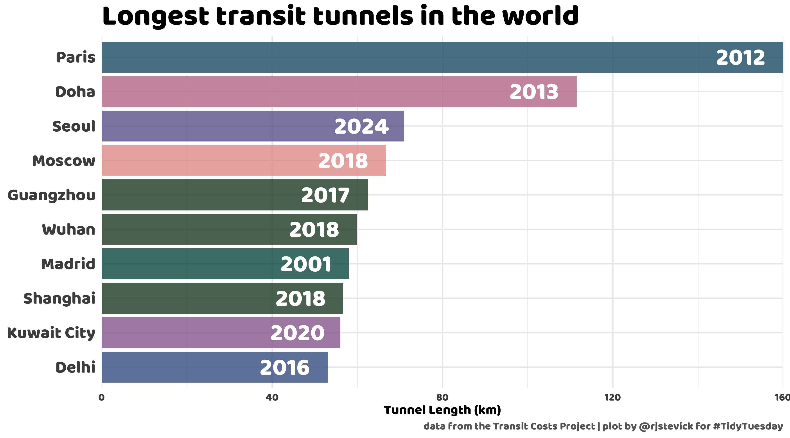
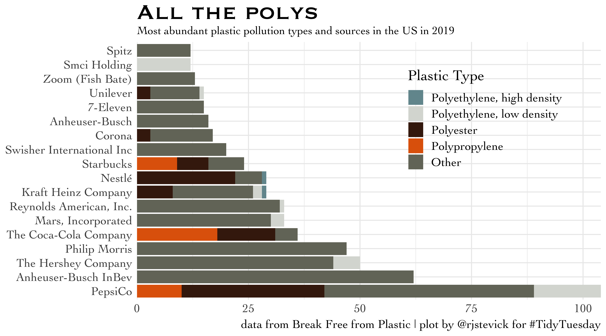
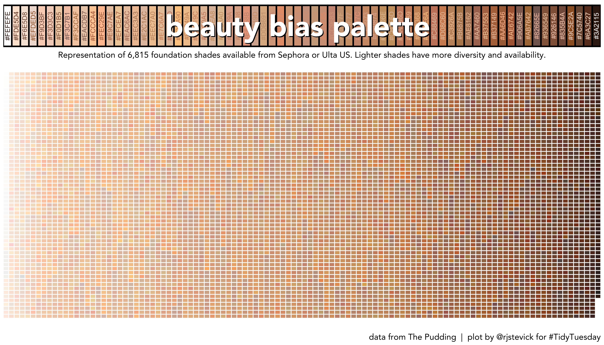
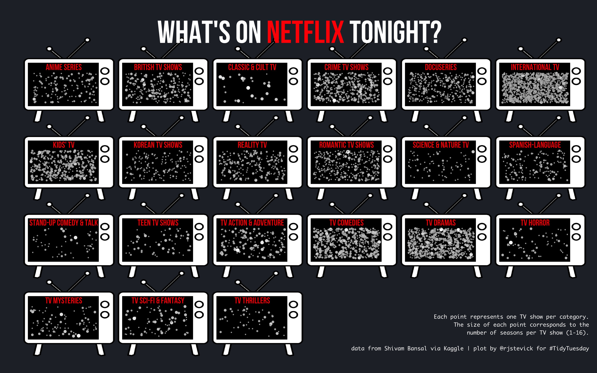
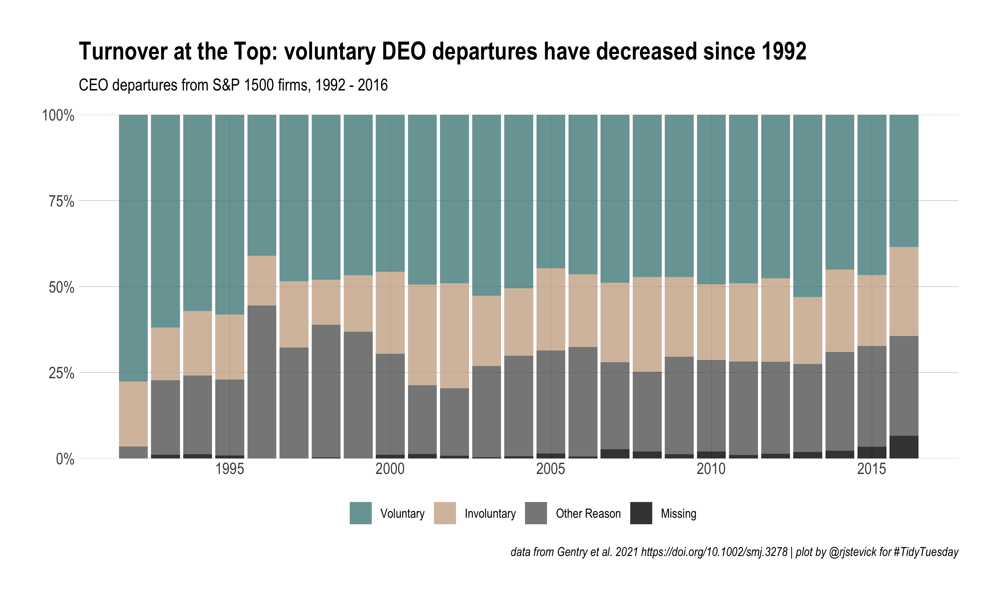
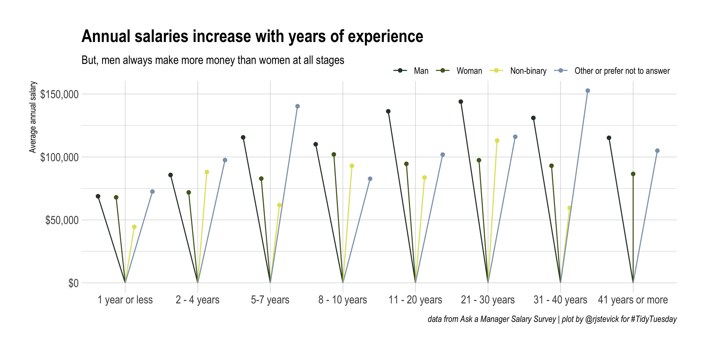

## 2021

| Week | Date | Data | Source | Link to code and plot |
| :---: | :----: | :--- | :--- | :--- |
| 2 | `2021-01-05` | [Transit Cost Project](https://github.com/rfordatascience/tidytuesday/blob/master/data/2021/2021-01-05/readme.md) | [TransitCosts.com](https://transitcosts.com/) |  |
| 3 | `2021-01-12` | [Art Collections](https://github.com/rfordatascience/tidytuesday/blob/master/data/2021/2021-01-12/readme.md) | [Tate Collection](http://bit.ly/3sev5lM) | |
| 4 | `2021-01-19` | [Kenya Census](https://github.com/rfordatascience/tidytuesday/blob/master/data/2021/2021-01-19/readme.md) | [`rKenyaCensus`](https://github.com/Shelmith-Kariuki/rKenyaCensus) | |
| 5 | `2021-01-26` | [Plastic Pollution](data/2021/2021-01-26/readme.md) | [Break Free from Plastic](https://www.breakfreefromplastic.org) | |
| 6 | `2021-02-02` | [HBCU Enrollment](https://github.com/rfordatascience/tidytuesday/blob/master/data/2021/2021-02-02/readme.md) | [Data.World](https://data.world/nces/hbcu-fall-enrollment-1976-2015) & [Data.World](https://data.world/nces/high-school-completion-and-bachelors-degree-attainment) | |
| 7 | `2021-02-09` | [Wealth and Income](https://github.com/rfordatascience/tidytuesday/blob/master/data/2021/2021-02-09/readme.md) | [Urban Institute](https://apps.urban.org/features/wealth-inequality-charts/) & [US Census](https://www.census.gov/data/tables/time-series/demo/income-poverty/historical-income-households.html) | |
| 8 | `2021-02-16` | [W.E.B. Du Bois Challenge](https://github.com/rfordatascience/tidytuesday/blob/master/data/2021/2021-02-16/readme.md) | [Du Bois Data Challenge](https://github.com/ajstarks/dubois-data-portraits/tree/master/challenge) | |
| 9 | `2021-02-23` | [Employment and Earnings](https://github.com/rfordatascience/tidytuesday/blob/master/data/2021/2021-02-23/readme.md) | [BLS](https://www.bls.gov/cps/tables.htm#charemp_m) | |
| 10 | `2021-03-02` | [SuperBowl Ads](https://github.com/rfordatascience/tidytuesday/blob/master/data/2021/2021-03-02/readme.md) | [FiveThirtyEight](https://github.com/fivethirtyeight/superbowl-ads) | |
| 11 | `2021-03-09` | [Bechdel Test](https://github.com/rfordatascience/tidytuesday/blob/master/data/2021/2021-03-09/readme.md) | [FiveThirtyEight](https://github.com/fivethirtyeight/data/tree/master/bechdel) | |
| 12 | `2021-03-16` | [Video Games + Sliced](https://github.com/rfordatascience/tidytuesday/blob/master/data/2021/2021-03-16/readme.md) | [Steam](https://www.kaggle.com/michau96/popularity-of-games-on-steam) | |
| 13 | `2021-03-23` | [UN Votes](https://github.com/rfordatascience/tidytuesday/blob/master/data/2021/2021-03-23/readme.md) | [Harvard Dataverse](https://dataverse.harvard.edu/dataset.xhtml?persistentId=hdl:1902.1/12379) | |
| 14 | `2021-03-30` | [Makeup Shades](https://github.com/rfordatascience/tidytuesday/blob/master/data/2021/2021-03-30/readme.md) | [The Pudding data](https://github.com/the-pudding/data/tree/master/foundation-names) | |
| 15 | `2021-04-06` | [Global deforestation](https://github.com/rfordatascience/tidytuesday/blob/master/data/2021/2021-04-06/readme.md) | [Our World in Data](https://ourworldindata.org/forests-and-deforestation) | |
| 16 | `2021-04-13` | [US Post Offices](https://github.com/rfordatascience/tidytuesday/blob/master/data/2021/2021-04-13/readme.md) | [Cameron Blevins and Richard W. Helbock](https://dataverse.harvard.edu/dataset.xhtml?persistentId=doi:10.7910/DVN/NUKCNA) | |
| 17 | `2021-04-20` | [Netflix Titles](https://github.com/rfordatascience/tidytuesday/blob/master/data/2021/2021-04-20/readme.md) | [Kaggle](https://www.kaggle.com/shivamb/netflix-shows) | |
| 18 | `2021-04-27` | [CEO Departures](https://github.com/rfordatascience/tidytuesday/blob/master/data/2021/2021-04-27/readme.md) | [Gentry et al.](https://onlinelibrary.wiley.com/doi/abs/10.1002/smj.3278) | |
| 19 | `2021-05-04` | [Water Access Points](https://github.com/rfordatascience/tidytuesday/blob/master/data/2021/2021-05-04/readme.md) | [WPDX](https://www.waterpointdata.org/) | |
| 20 | `2021-05-11` | [US Broadband](https://github.com/rfordatascience/tidytuesday/blob/master/data/2021/2021-05-11/readme.md) | [Microsoft GitHub](https://github.com/microsoft/USBroadbandUsagePercentages) | |
| 21 | `2021-05-18` | [Ask a Manager Salary Survey](https://github.com/rfordatascience/tidytuesday/blob/master/data/2021/2021-05-18/readme.md) | [Ask a Manager](https://docs.google.com/spreadsheets/d/1IPS5dBSGtwYVbjsfbaMCYIWnOuRmJcbequohNxCyGVw/edit?resourcekey#gid=1625408792) | |
| 22 | `2021-05-25` | [Mario Kart World Records](https://github.com/rfordatascience/tidytuesday/blob/master/data/2021/2021-05-25/readme.md) | [Mario Kart World Records](https://mkwrs.com/) |  |
