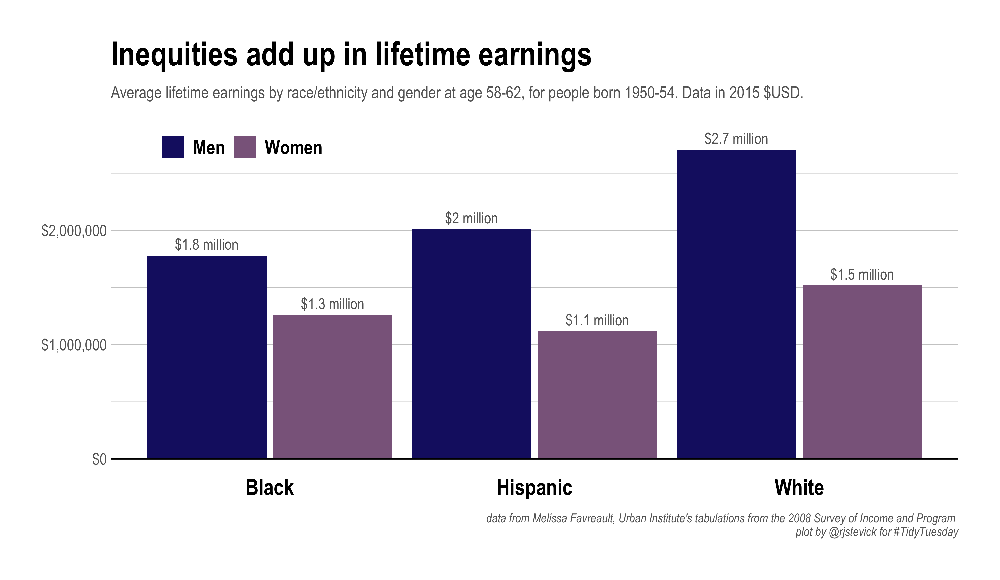
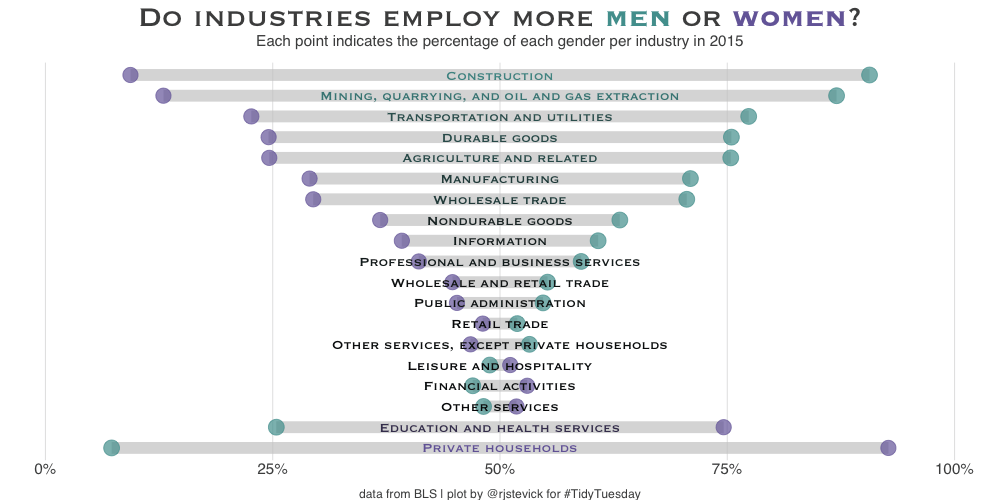

## 2021

| Week | Date | Data | Source | Link to code and plot |
| :---: | :----: | :--- | :--- | :--- |
| 2 | `2021-01-05` | [Transit Cost Project](https://github.com/rfordatascience/tidytuesday/blob/master/data/2021/2021-01-05/readme.md) | [TransitCosts.com](https://transitcosts.com/) |  |
| 3 | `2021-01-12` | [Art Collections](https://github.com/rfordatascience/tidytuesday/blob/master/data/2021/2021-01-12/readme.md) | [Tate Collection](http://bit.ly/3sev5lM) | |
| 4 | `2021-01-19` | [Kenya Census](https://github.com/rfordatascience/tidytuesday/blob/master/data/2021/2021-01-19/readme.md) | [`rKenyaCensus`](https://github.com/Shelmith-Kariuki/rKenyaCensus) | |
| 5 | `2021-01-26` | [Plastic Pollution](data/2021/2021-01-26/readme.md) | [Break Free from Plastic](https://www.breakfreefromplastic.org) | |
| 6 | `2021-02-02` | [HBCU Enrollment](https://github.com/rfordatascience/tidytuesday/blob/master/data/2021/2021-02-02/readme.md) | [Data.World](https://data.world/nces/hbcu-fall-enrollment-1976-2015) & [Data.World](https://data.world/nces/high-school-completion-and-bachelors-degree-attainment) | |
| 7 | `2021-02-09` | [Wealth and Income](https://github.com/rfordatascience/tidytuesday/blob/master/data/2021/2021-02-09/readme.md) | [Urban Institute](https://apps.urban.org/features/wealth-inequality-charts/) & [US Census](https://www.census.gov/data/tables/time-series/demo/income-poverty/historical-income-households.html) | |
| 8 | `2021-02-16` | [W.E.B. Du Bois Challenge](https://github.com/rfordatascience/tidytuesday/blob/master/data/2021/2021-02-16/readme.md) | [Du Bois Data Challenge](https://github.com/ajstarks/dubois-data-portraits/tree/master/challenge) | |
| 9 | `2021-02-23` | [Employment and Earnings](https://github.com/rfordatascience/tidytuesday/blob/master/data/2021/2021-02-23/readme.md) | [BLS](https://www.bls.gov/cps/tables.htm#charemp_m) | |
