# TidyTuesday challenge code and plots

**A weekly data project in R from the R4DS online learning community**
https://github.com/rfordatascience/tidytuesday/

> The #tidytuesday project is a weekly data project aimed at the `R` ecosystem. An emphasis will be placed on understanding how to summarize and arrange data to make meaningful charts with `ggplot2`, `tidyr`, `dplyr`, and other tools in the `tidyverse` ecosystem.

## Contents
**My analyses and visualization of the datasets are organized by week. Each folder contains an Rscript and the resulting plot/graph/animation. Click on the image to go to its code.**

### [2021](2021/)

| Week | Date | Data | Source | Link to code and plot |
| :---: | :----: | :--- | :--- | :---: |
| 22 | `2021-05-25` | [Mario Kart World Records](https://github.com/rfordatascience/tidytuesday/blob/master/data/2021/2021-05-25/readme.md) | [Mario Kart World Records](https://mkwrs.com/) |  |
| 21 | `2021-05-18` | [Ask a Manager Salary Survey](https://github.com/rfordatascience/tidytuesday/blob/master/data/2021/2021-05-18/readme.md) | [Ask a Manager](https://docs.google.com/spreadsheets/d/1IPS5dBSGtwYVbjsfbaMCYIWnOuRmJcbequohNxCyGVw/edit?resourcekey#gid=1625408792) | <a href="2021/20210518_SalarySurvey/tidytuesday_20210518.R"> 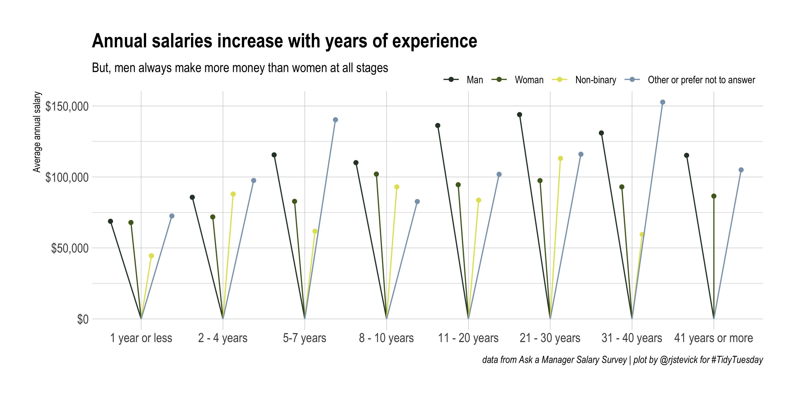</a>|
| 20 | `2021-05-11` | [US Broadband](https://github.com/rfordatascience/tidytuesday/blob/master/data/2021/2021-05-11/readme.md) | [Microsoft GitHub](https://github.com/microsoft/USBroadbandUsagePercentages) | <a href="2021/20210511_USBroadband/tidytuesday_20210511.R"> 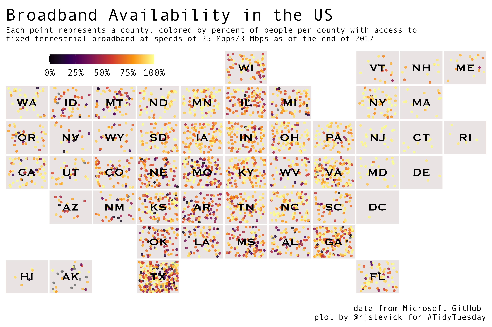</a>|
| 19 | `2021-05-04` | [Water Access Points](https://github.com/rfordatascience/tidytuesday/blob/master/data/2021/2021-05-04/readme.md) | [WPDX](https://www.waterpointdata.org/) | |
| 18 | `2021-04-27` | [CEO Departures](https://github.com/rfordatascience/tidytuesday/blob/master/data/2021/2021-04-27/readme.md) | [Gentry et al.](https://onlinelibrary.wiley.com/doi/abs/10.1002/smj.3278) | <a href="2021/20210427_CEODepartures/tidytuesday_20210427.R"> 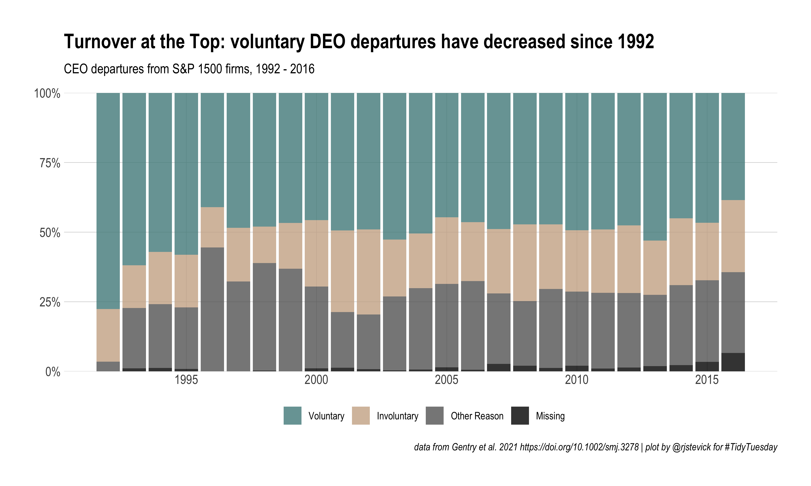</a>|
| 17 | `2021-04-20` | [Netflix Titles](https://github.com/rfordatascience/tidytuesday/blob/master/data/2021/2021-04-20/readme.md) | [Kaggle](https://www.kaggle.com/shivamb/netflix-shows) | |
| 16 | `2021-04-13` | [US Post Offices](https://github.com/rfordatascience/tidytuesday/blob/master/data/2021/2021-04-13/readme.md) | [Cameron Blevins and Richard W. Helbock](https://dataverse.harvard.edu/dataset.xhtml?persistentId=doi:10.7910/DVN/NUKCNA) | |
| 15 | `2021-04-06` | [Global deforestation](https://github.com/rfordatascience/tidytuesday/blob/master/data/2021/2021-04-06/readme.md) | [Our World in Data](https://ourworldindata.org/forests-and-deforestation) | <a href="2021/20210406_GlobalDeforestation/tidytuesday_20210406.R"> 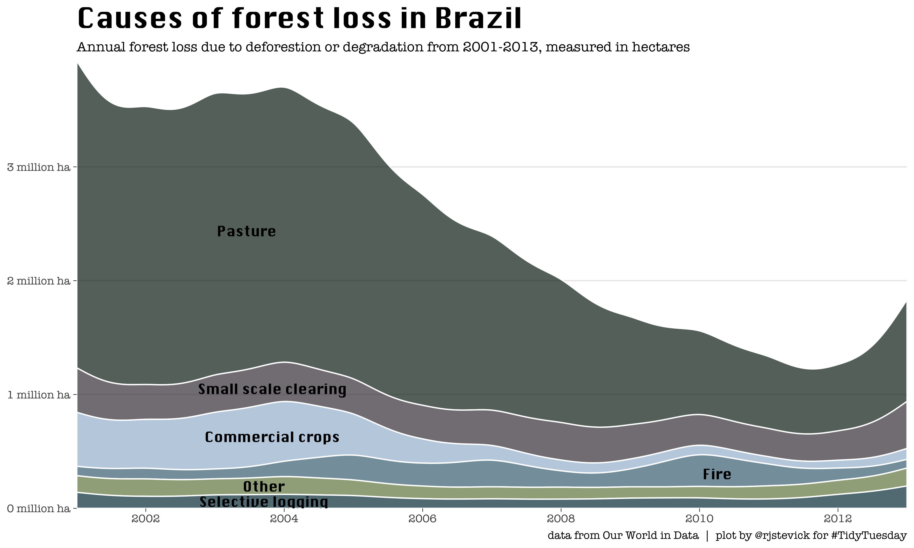</a>|
| 14 | `2021-03-30` | [Makeup Shades](https://github.com/rfordatascience/tidytuesday/blob/master/data/2021/2021-03-30/readme.md) | [The Pudding data](https://github.com/the-pudding/data/tree/master/foundation-names) | <a href="2021/20210330_MakeupShades/tidytuesday_20210330.R"> 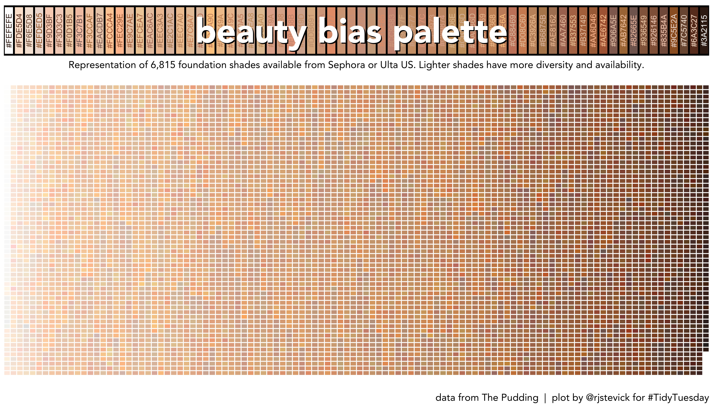</a>|
| 13 | `2021-03-23` | [UN Votes](https://github.com/rfordatascience/tidytuesday/blob/master/data/2021/2021-03-23/readme.md) | [Harvard Dataverse](https://dataverse.harvard.edu/dataset.xhtml?persistentId=hdl:1902.1/12379) | |
| 12 | `2021-03-16` | [Video Games + Sliced](https://github.com/rfordatascience/tidytuesday/blob/master/data/2021/2021-03-16/readme.md) | [Steam](https://www.kaggle.com/michau96/popularity-of-games-on-steam) | <a href="2021/20210316_VideoGames/tidytuesday_20210316.R"> 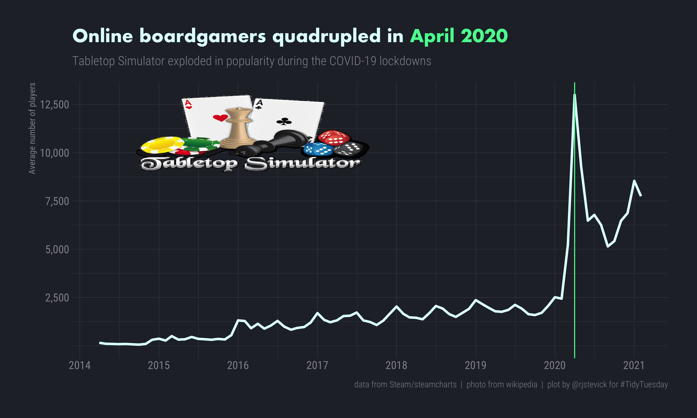</a>|
| 11 | `2021-03-09` | [Bechdel Test](https://github.com/rfordatascience/tidytuesday/blob/master/data/2021/2021-03-09/readme.md) | [FiveThirtyEight](https://github.com/fivethirtyeight/data/tree/master/bechdel) | <a href="2021/20210309_BechdelTest/tidytuesday_20210309.R"> 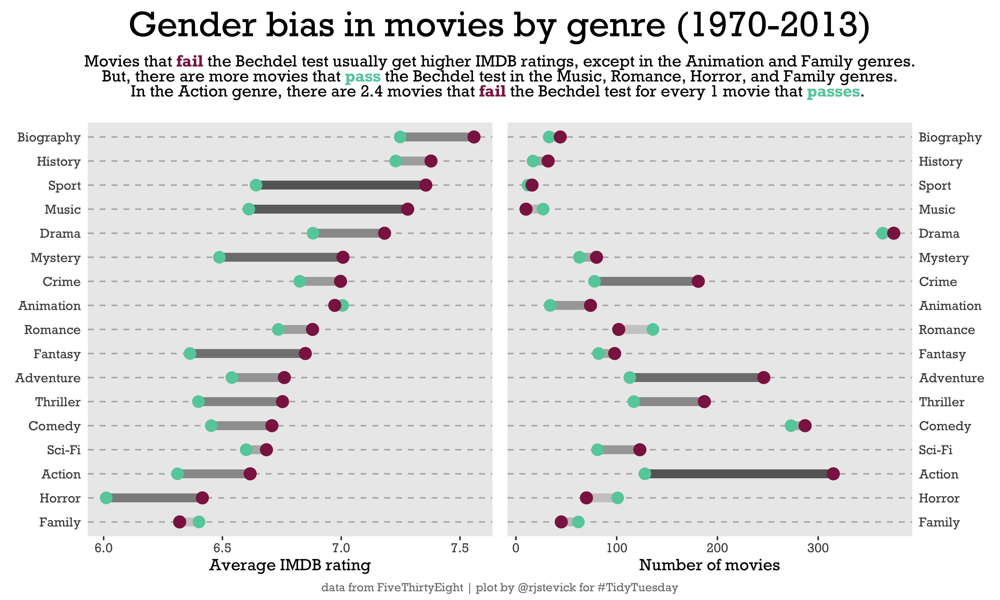</a>|
| 10 | `2021-03-02` | [SuperBowl Ads](https://github.com/rfordatascience/tidytuesday/blob/master/data/2021/2021-03-02/readme.md) | [FiveThirtyEight](https://github.com/fivethirtyeight/superbowl-ads) | <a href="2021/20210302_SuperBowlAds/tidytuesday_20210302.R"> 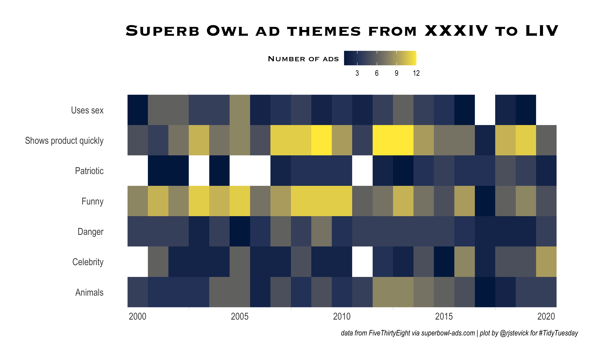</a>|
| 9 | `2021-02-23` | [Employment and Earnings](https://github.com/rfordatascience/tidytuesday/blob/master/data/2021/2021-02-23/readme.md) | [BLS](https://www.bls.gov/cps/tables.htm#charemp_m) | |
| 8 | `2021-02-16` | [W.E.B. Du Bois Challenge](https://github.com/rfordatascience/tidytuesday/blob/master/data/2021/2021-02-16/readme.md) | [Du Bois Data Challenge](https://github.com/ajstarks/dubois-data-portraits/tree/master/challenge) | <a href="2021/20210216_DuBoisChallenge/tidytuesday_20210216.R"> 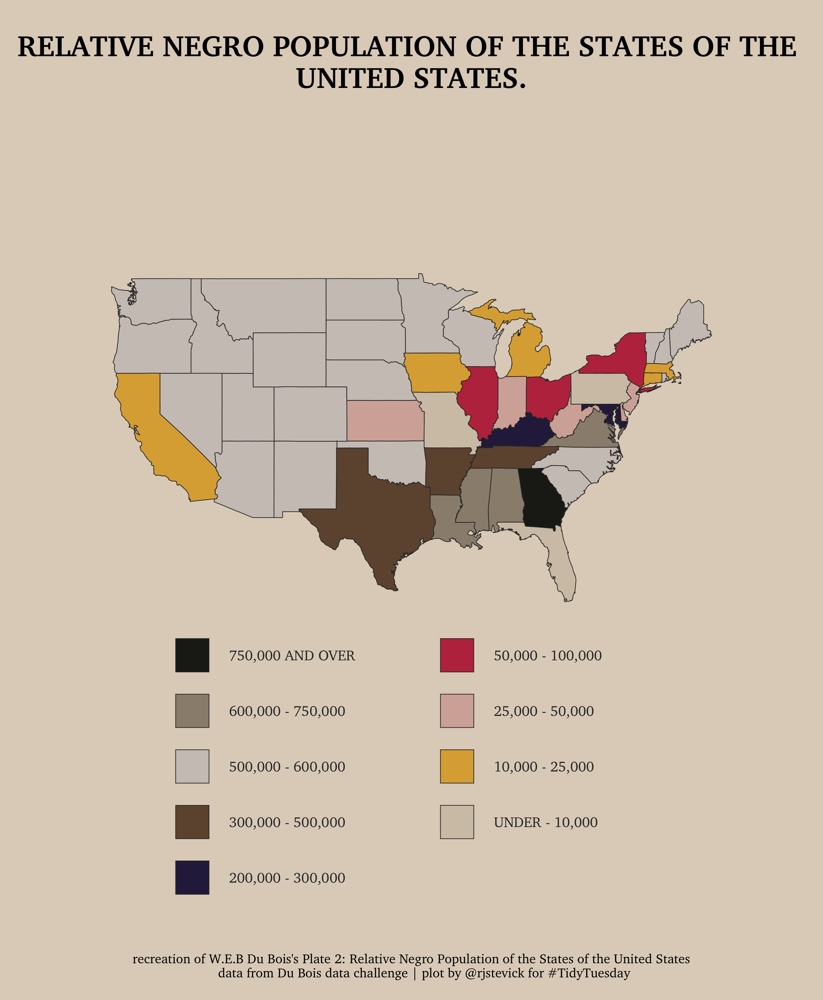</a>|
| 7 | `2021-02-09` | [Wealth and Income](https://github.com/rfordatascience/tidytuesday/blob/master/data/2021/2021-02-09/readme.md) | [Urban Institute](https://apps.urban.org/features/wealth-inequality-charts/) & [US Census](https://www.census.gov/data/tables/time-series/demo/income-poverty/historical-income-households.html) | <a href="2021/20210209_WealthIncome/tidytuesday_20210209.R"> 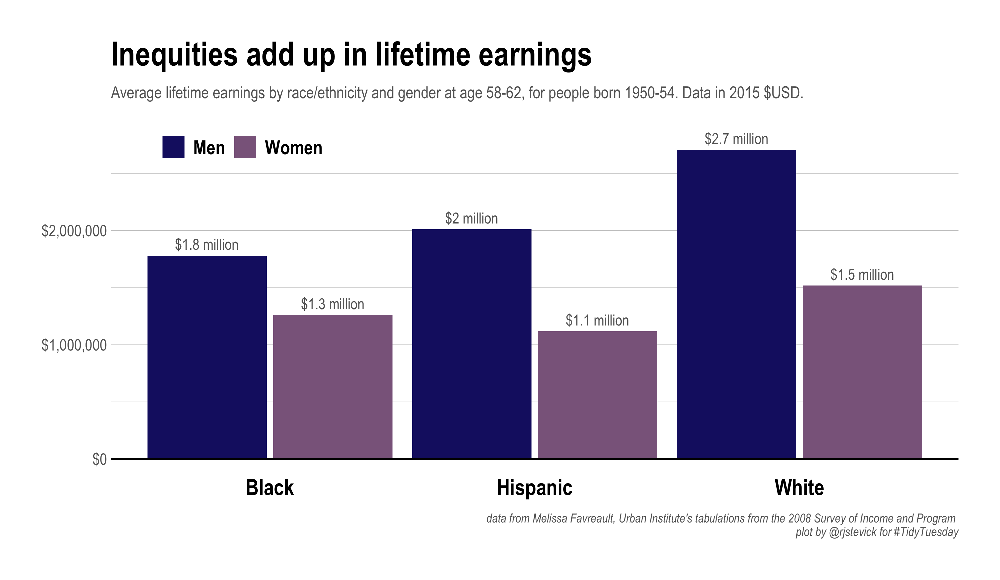</a>|
| 6 | `2021-02-02` | [HBCU Enrollment](https://github.com/rfordatascience/tidytuesday/blob/master/data/2021/2021-02-02/readme.md) | [Data.World](https://data.world/nces/hbcu-fall-enrollment-1976-2015) & [Data.World](https://data.world/nces/high-school-completion-and-bachelors-degree-attainment) | <a href="2021/20210202_HBCUenrollment/tidytuesday_20210202.R"> 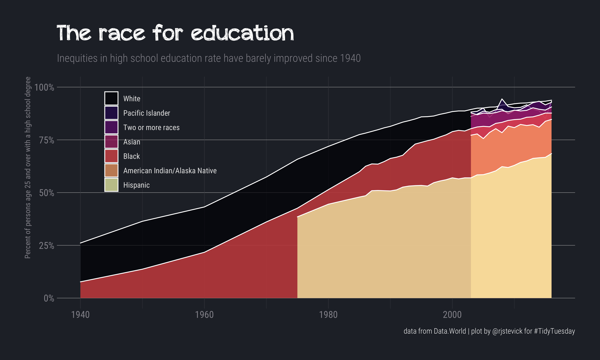</a>|
| 5 | `2021-01-26` | [Plastic Pollution](https://github.com/rfordatascience/tidytuesday/blob/master/data/2021/2021-01-26/readme.md) | [Break Free from Plastic](https://www.breakfreefromplastic.org) | <a href="2021/20210126_PlasticPollution/tidytuesday_20210126.R"> 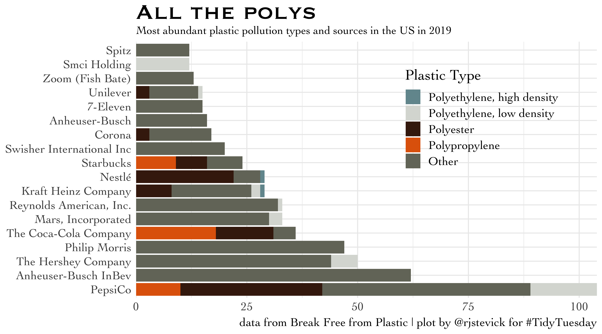</a>|
| 4 | `2021-01-19` | [Kenya Census](https://github.com/rfordatascience/tidytuesday/blob/master/data/2021/2021-01-19/readme.md) | [`rKenyaCensus`](https://github.com/Shelmith-Kariuki/rKenyaCensus) | <a href="2021/20210119_KenyaCensus/tidytuesday_20210119.R"> 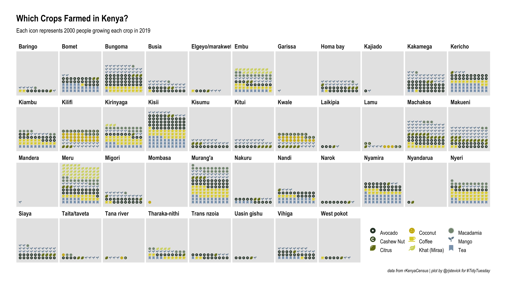</a>|
| 3 | `2021-01-12` | [Art Collections](https://github.com/rfordatascience/tidytuesday/blob/master/data/2021/2021-01-12/readme.md) | [Tate Collection](http://bit.ly/3sev5lM) | <a href="2021/20210112_ArtCollections/tidytuesday_20210112.R"> 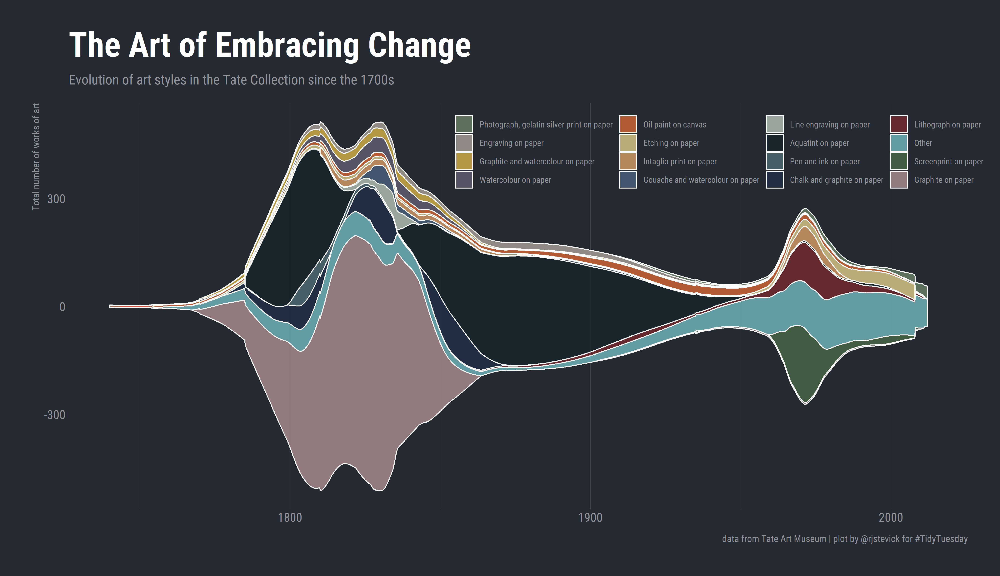</a>|
| 2 | `2021-01-05` | [Transit Cost Project](https://github.com/rfordatascience/tidytuesday/blob/master/data/2021/2021-01-05/readme.md) | [TransitCosts.com](https://transitcosts.com/) | <a href="2021/20210105_TransitCostProject/tidytuesday_20210105.R"> 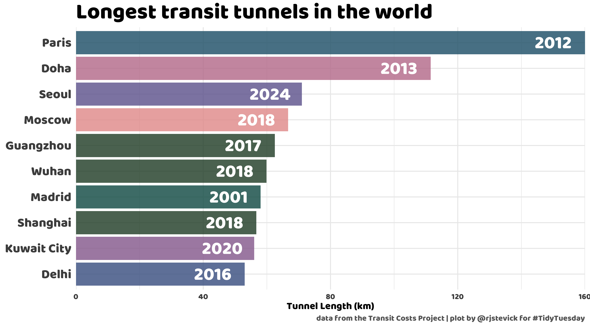</a>|

### [2020](2020/)

| Week | Date | Data | Source | Link to code and plot |
| :---: | :----: | :--- | :--- | :---: |
| 52 | `2020-12-22` | [Big Mac Index](2020-12-22/readme.md) | [TheEconomist](https://github.com/TheEconomist/big-mac-data) | <a href="2020/20201222_BigMacIndex/tidytuesday_20201222.R">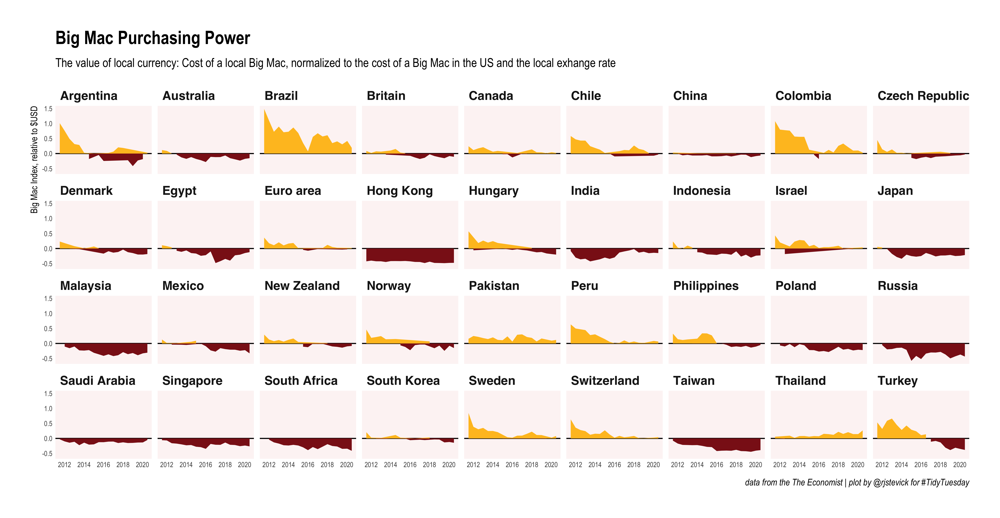</a>|
| 51 | `2020-12-15` | [Ninja Warrior](data/2020/2020-12-15/readme.md) | [Data.World](https://data.world/ninja/anw-obstacle-history) | <a href="2020/20201215_NinjaWarrior/tidytuesday_20201215.R">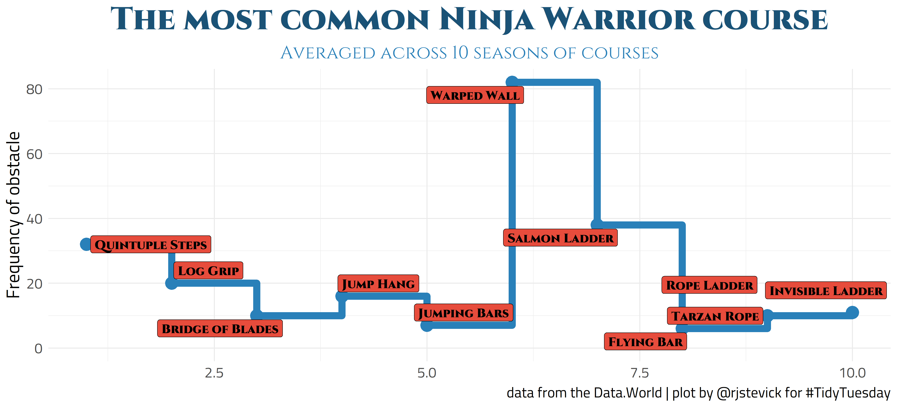</a>|
| 50 | `2020-12-08` | [Women of 2020](https://github.com/rfordatascience/tidytuesday/blob/master/data/2020/2020-12-08/readme.md) | [BBC](https://www.bbc.com/news/world-55042935) | |
| 49 | `2020-12-01` | [Toronto Shelters](https://github.com/rfordatascience/tidytuesday/blob/master/data/2020/2020-12-01/readme.md) | [`opendatatoronto`](https://github.com/sharlagelfand/opendatatoronto) | <a href="2020/20201201_TorontoShelters/tidytuesday_20201201.R">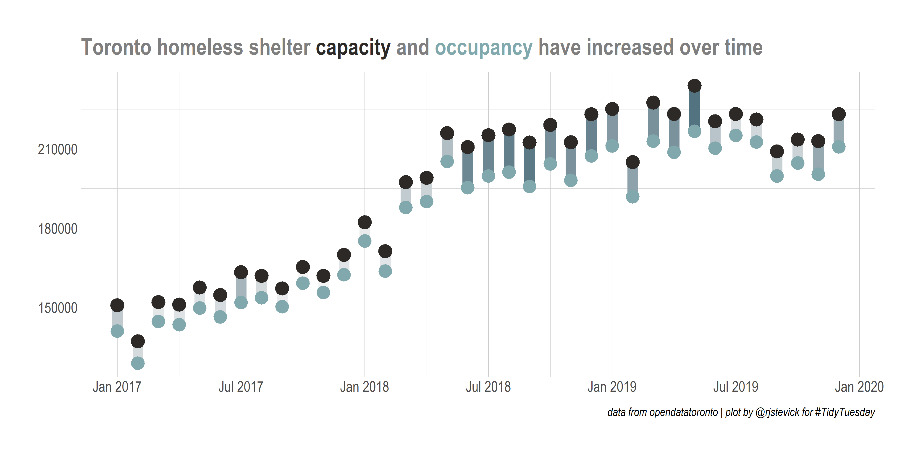</a>|
| 48 | `2020-11-24` | [Washington Trails](https://github.com/rfordatascience/tidytuesday/blob/master/data/2020/2020-11-24/readme.md) | [WTA](https://www.wta.org/go-outside/hikes?b_start:int=1) | <a href="2020/20201124_WashingtonTrails/tidytuesday_20201124.R">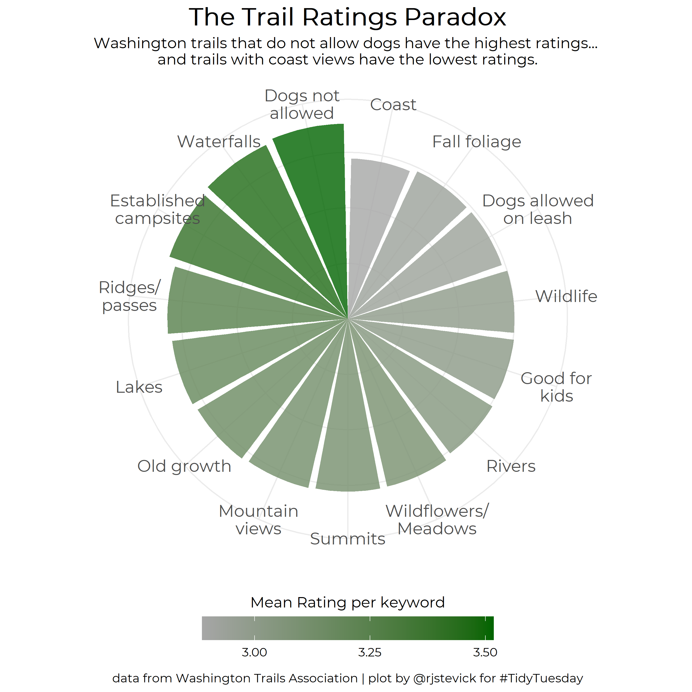</a>|
| 47 | `2020-11-17` | [Black in Data](https://github.com/rfordatascience/tidytuesday/blob/master/data/2020/2020-11-17/readme.md) | [Black in Data Week](https://blkindata.github.io/bidweek2020/) | <a href="2020/20201117_BlackInData/tidytuesday_20201117.R">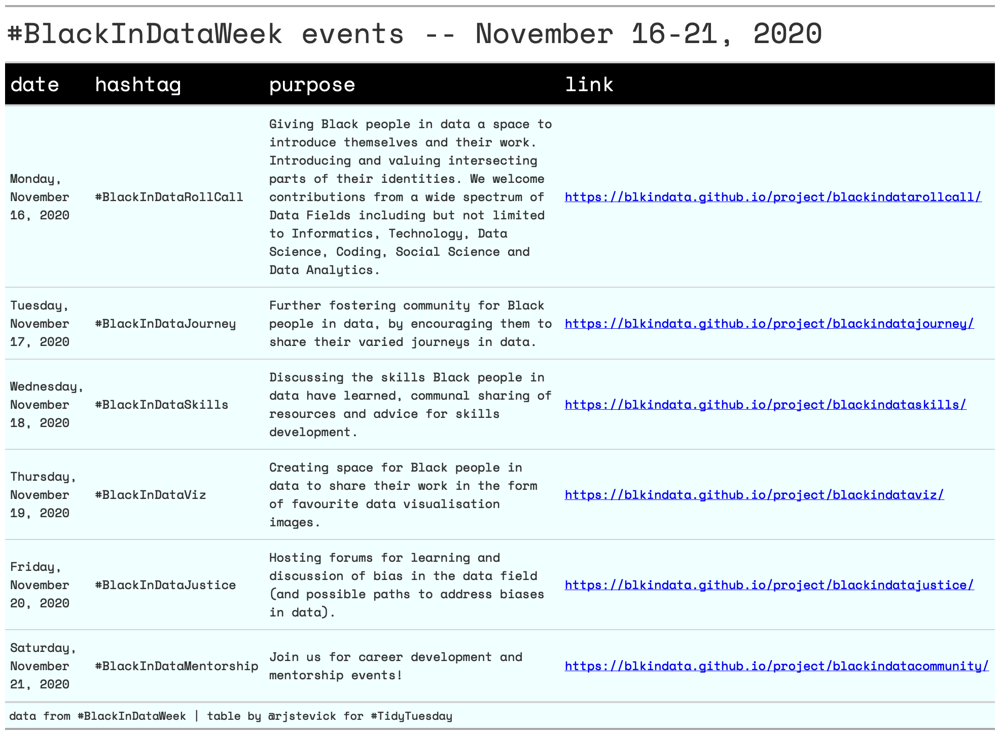</a>|
| 46 | `2020-11-10` | [Historical Phones](https://github.com/rfordatascience/tidytuesday/blob/master/data/2020/2020-11-10/readme.md) | [Mobile vs Landline subscriptions](https://ourworldindata.org/technology-adoption#technology-leapfrogging) | <a href="2020/20201110_HistoricalPhones/tidytuesday_20201110.R">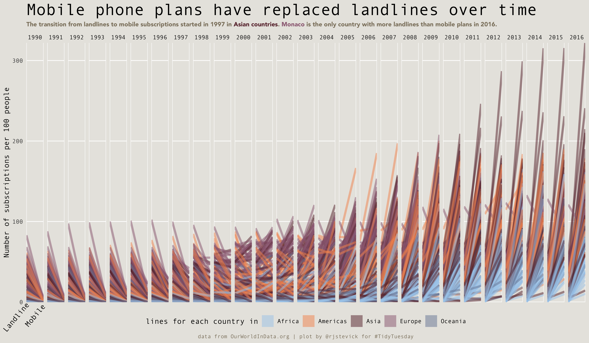</a>|
| 45 | `2020-11-03` | [IKEA Furniture](https://github.com/rfordatascience/tidytuesday/blob/master/data/2020/2020-11-03/readme.md) | [Kaggle](https://www.kaggle.com/ahmedkallam/ikea-sa-furniture-web-scraping) | <a href="2020/20201103_IkeaFurniture/tidytuesday_20201103.R">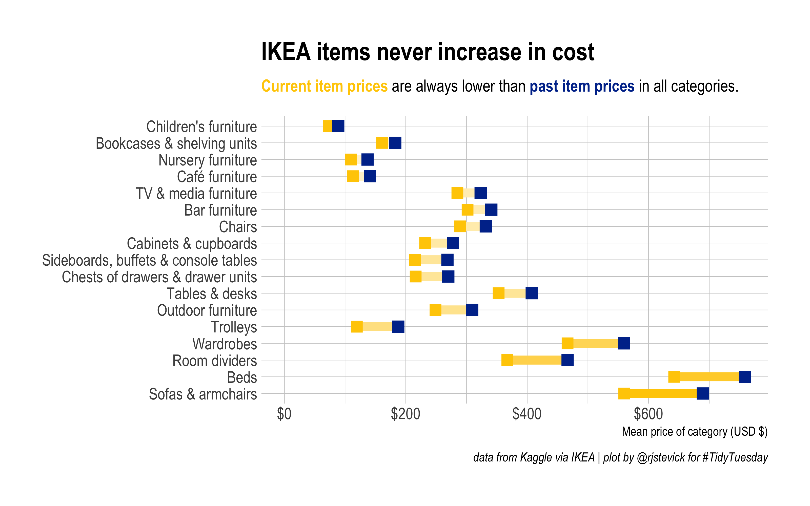</a>|
| 44 | `2020-10-27` | [Canadian Wind Turbines](https://github.com/rfordatascience/tidytuesday/blob/master/data/2020/2020-10-27/readme.md) | [open.canada.ca](https://open.canada.ca/data/en/dataset/79fdad93-9025-49ad-ba16-c26d718cc070) | |
| 43 | `2020-10-20` | [Great American Beer Festival Data](https://github.com/rfordatascience/tidytuesday/blob/master/data/2020/2020-10-20/readme.md) | [Great American Beer Festival](https://www.greatamericanbeerfestival.com/the-competition/winners/) | <a href="2020/20201020_AmericanBeerFestival/tidytuesday_20201020.R">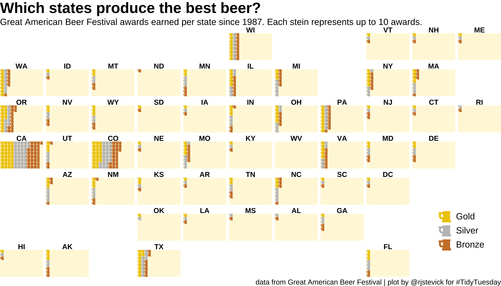</a>|
| 42 | `2020-10-13` | [`datasauRus` dozen](https://github.com/rfordatascience/tidytuesday/blob/master/data/2020/2020-10-13/readme.md) | [Alberto Cairo blogpost](http://www.thefunctionalart.com/2016/08/download-datasaurus-never-trust-summary.html) | |
| 41 | `2020-10-06` | [NCAA Women's Basketball](https://github.com/rfordatascience/tidytuesday/blob/master/data/2020/2020-10-06/readme.md) | [FiveThirtyEight](https://fivethirtyeight.com/features/louisiana-tech-was-the-uconn-of-the-80s/) |  <a href="2020/20201006_NCAAwomensBasketball/tidytuesday_20201006.R">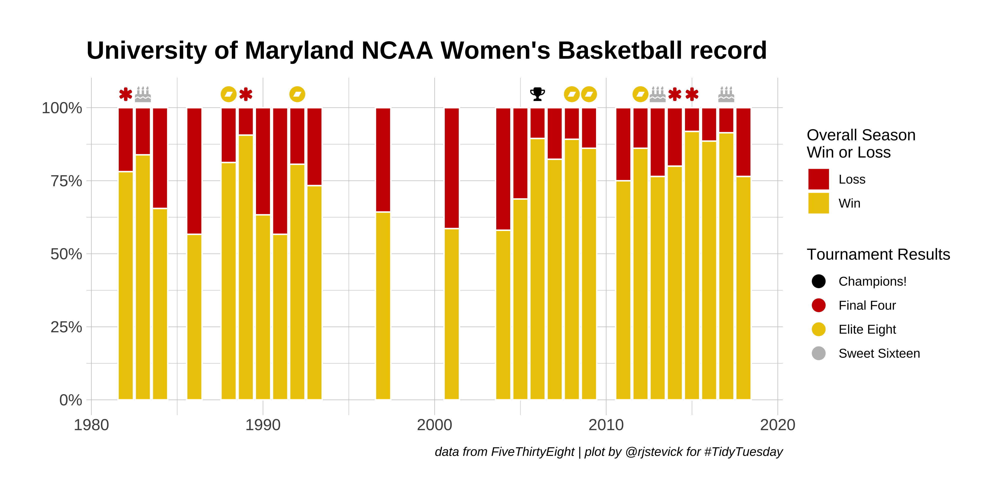</a>|
| 40 | `2020-09-29` | [Beyonce & Taylor Swift Lyrics](https://github.com/rfordatascience/tidytuesday/blob/master/data/2020/2020-09-29/readme.md) | [Rosie Baillie](https://twitter.com/Rosie_Baillie_) and [Dr. Sara Stoudt](https://twitter.com/sastoudt) | <a href="2020/20200929_BeyonceTaylorSwift/tidytuesday_20200929.R">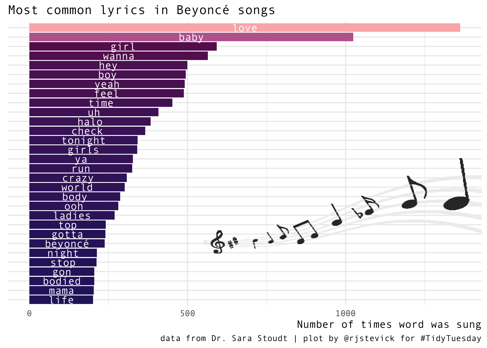</a>|
| 39 | `2020-09-22` | [Himalayan Climbers](https://github.com/rfordatascience/tidytuesday/blob/master/data/2020/2020-09-22/readme.md) | [The Himalayan Database](https://www.himalayandatabase.com/) | <a href="2020/20200922_HimalayanClimbers/tidytuesday_20200922.R">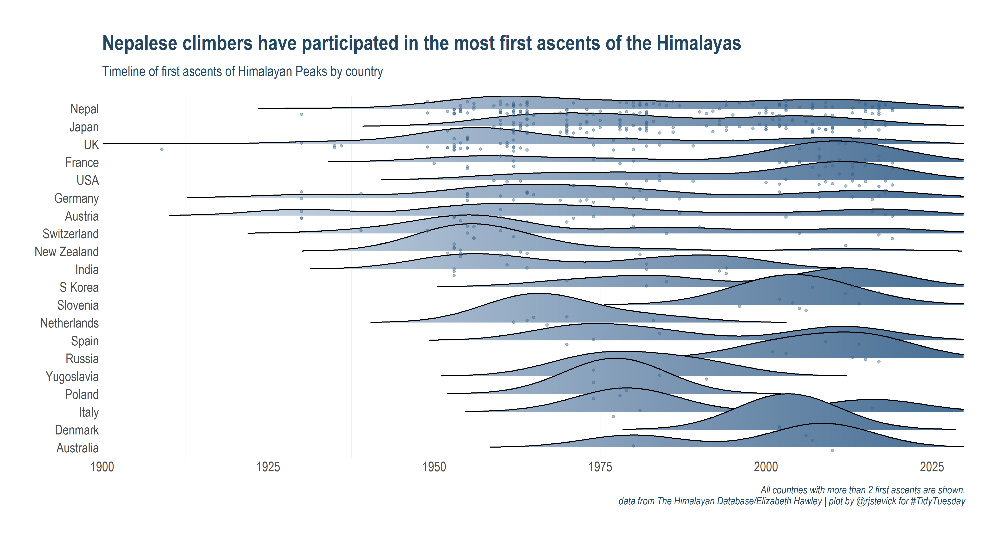</a>|
| 38 | `2020-09-15` | [Gov Spending on Kids](https://github.com/rfordatascience/tidytuesday/blob/master/data/2020/2020-09-15/readme.md) | [Urban Institute](https://datacatalog.urban.org/dataset/state-state-spending-kids-dataset) | <a href="2020/20200915_GovKidSpending/tidytuesday_20200915.R">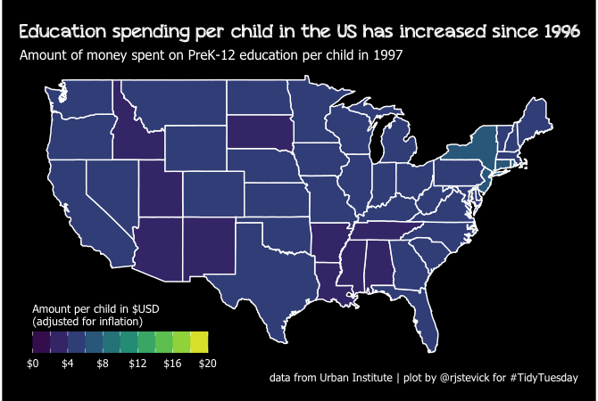</a>|
| 37 | `2020-09-08` | [Friends](https://github.com/rfordatascience/tidytuesday/blob/master/data/2020/2020-09-08/readme.md) | [`friends` R package](https://github.com/EmilHvitfeldt/friends) | <a href="2020/20200908_Friends/tidytuesday_20200908.R">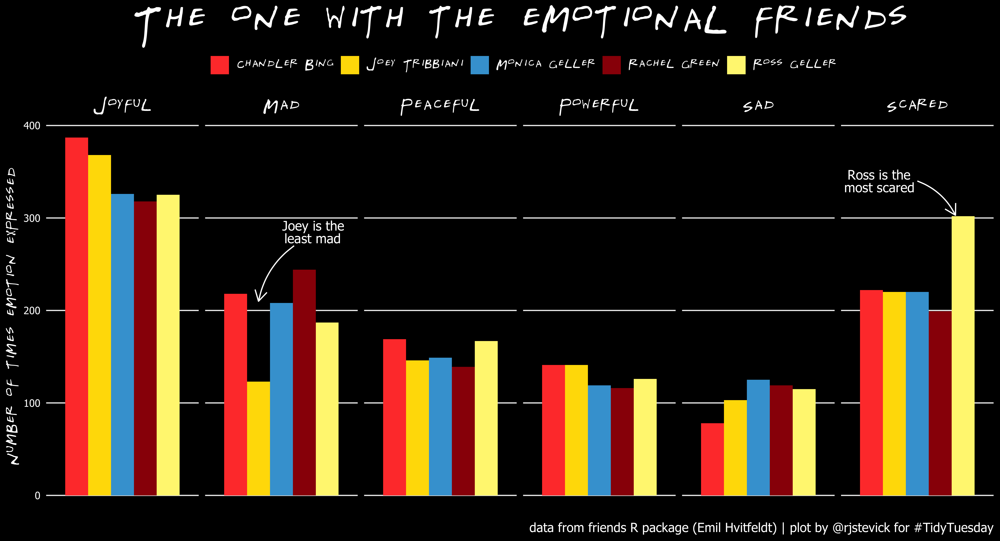</a>|
| 36 | `2020-09-01` | [Global Crop Yields](https://github.com/rfordatascience/tidytuesday/blob/master/data/2020/2020-09-01/readme.md) | [Our World in Data](https://ourworldindata.org/crop-yields) | <a href="2020/20200901_GlobalCropYields/tidytuesday_20200901.R">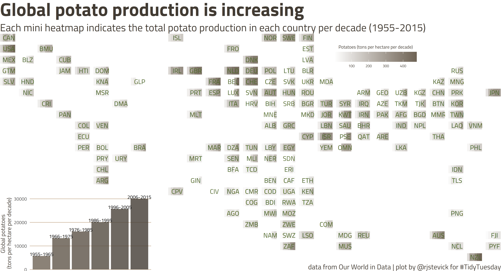</a>|
| 35 | `2020-08-25` | [Chopped](https://github.com/rfordatascience/tidytuesday/blob/master/data/2020/2020-08-25/readme.md) | [Kaggle](https://www.kaggle.com/jeffreybraun/chopped-10-years-of-episode-data) & [IMDB](https://www.imdb.com/title/tt1353281/episodes?ref_=tt_eps_sn_mr) | <a href="2020/20200825_Chopped/tidytuesday_20200825.R">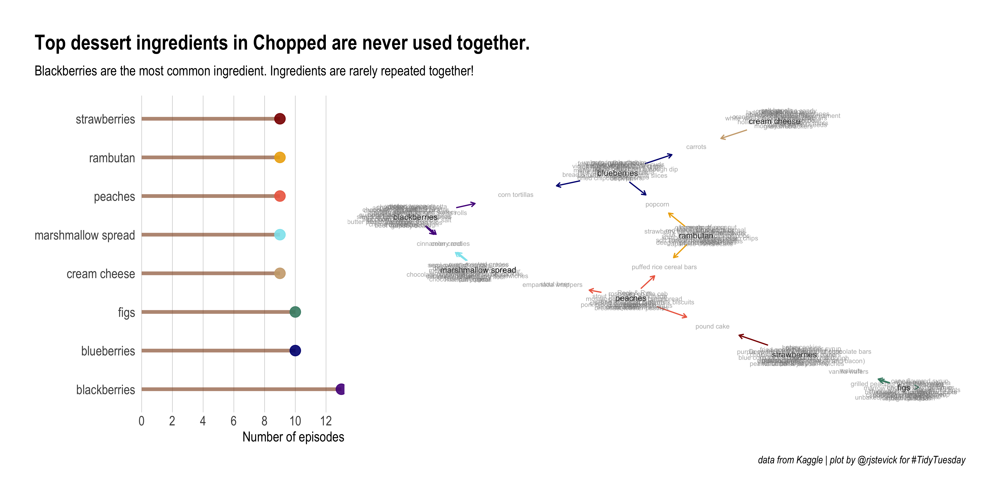</a>|
| 34 | `2020-08-18` | [Extinct Plants](https://github.com/rfordatascience/tidytuesday/blob/master/data/2020/2020-08-18/readme.md) | [IUCN Red List](https://www.iucnredlist.org/) | <a href="2020/20200818_ExtinctPlants/tidytuesday_20200818.R">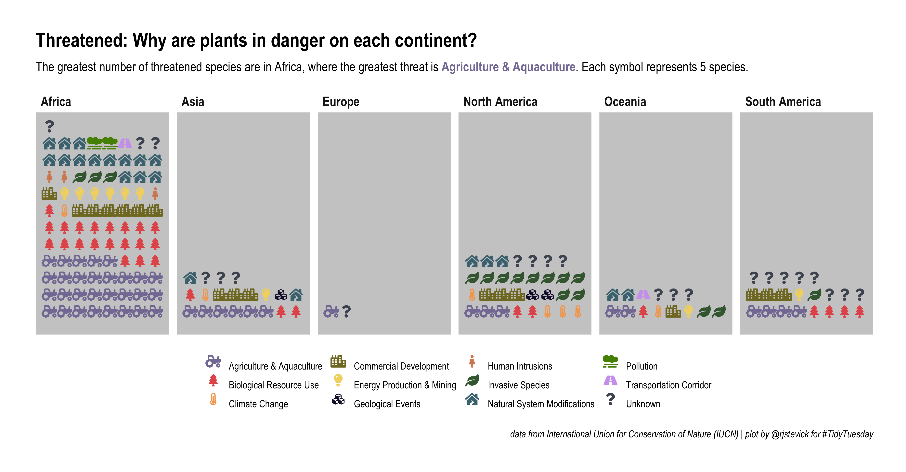</a>|
| 33 | `2020-08-11` | [Avatar: The Last Airbender](https://github.com/rfordatascience/tidytuesday/blob/master/data/2020/2020-08-11/readme.md) | [`appa`](https://github.com/averyrobbins1/appa) | <a href="2020/20200811_AvatarLastAirbender/tidytuesday_20200811.R">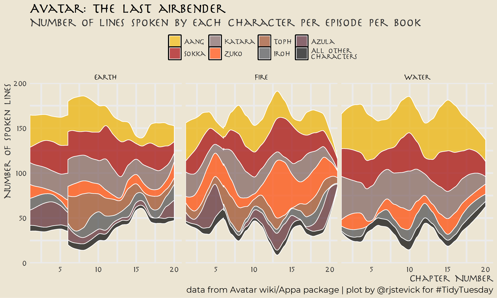</a>|
| 32 | `2020-08-04` | [European Energy](https://github.com/rfordatascience/tidytuesday/blob/master/data/2020/2020-08-04/readme.md) | [Eurostat Energy](https://ec.europa.eu/eurostat/statistics-explained/index.php/Electricity_generation_statistics_%E2%80%93_first_results) | <a href="2020/20200804_EuropeanEnergy/tidytuesday_20200804.R">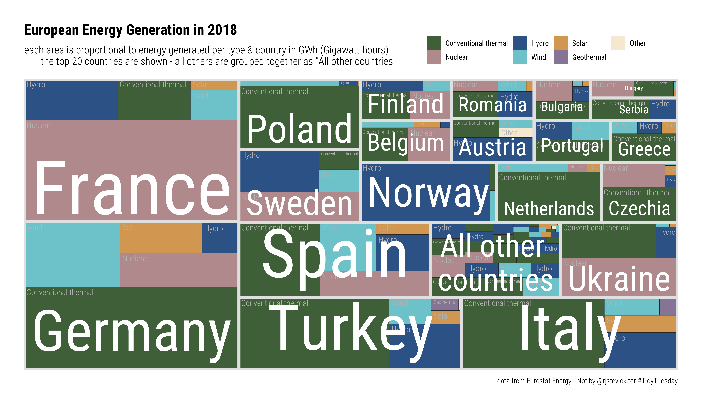</a>|
| 31 | `2020-07-28` | [Palmer Penguins](https://github.com/rfordatascience/tidytuesday/blob/master/data/2020/2020-07-28/readme.md) | [Gorman, Williams & Fraser, 2014](https://doi.org/10.1371/journal.pone.0090081) | <a href="2020/20200728_PalmerPenguins/tidytuesday_20200728.R">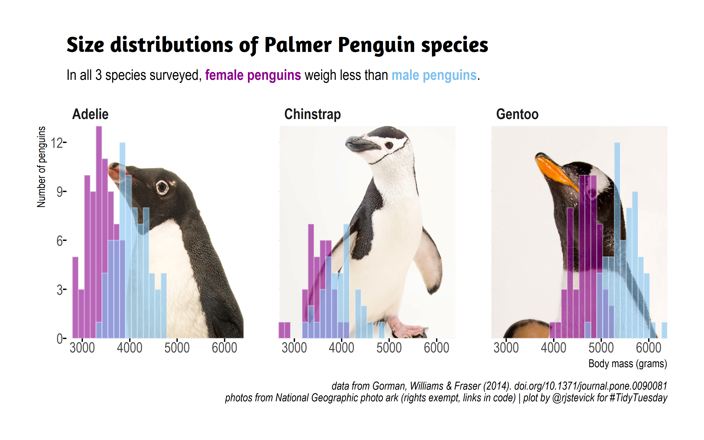</a>|
| 30 | `2020-07-21` | [Australian Animal Outcomes](https://github.com/rfordatascience/tidytuesday/blob/master/data/2020/2020-07-21/readme.md) | [RSPCA](https://www.rspca.org.au/what-we-do/our-role-caring-animals/annual-statistics) | <a href="2020/20200721_AustralianAnimals/tidytuesday_20200721.R">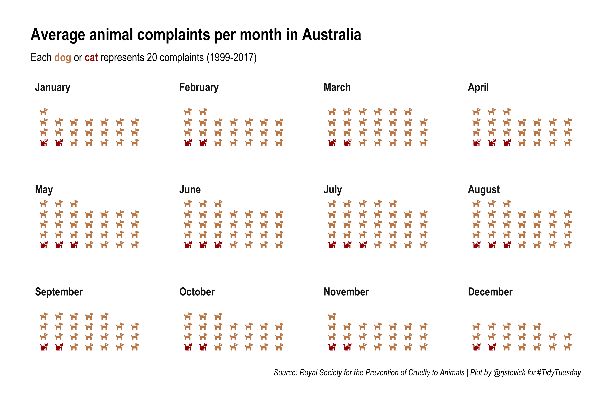</a>|
| 29 | `2020-07-14` | [Astronaut Database](https://github.com/rfordatascience/tidytuesday/blob/master/data/2020/2020-07-14/readme.md) | [Corlett, Stavnichuk & Komarova](https://www.sciencedirect.com/science/article/abs/pii/S2214552420300444) | <a href="2020/20200714_Astronauts/tidytuesday_20200714.R">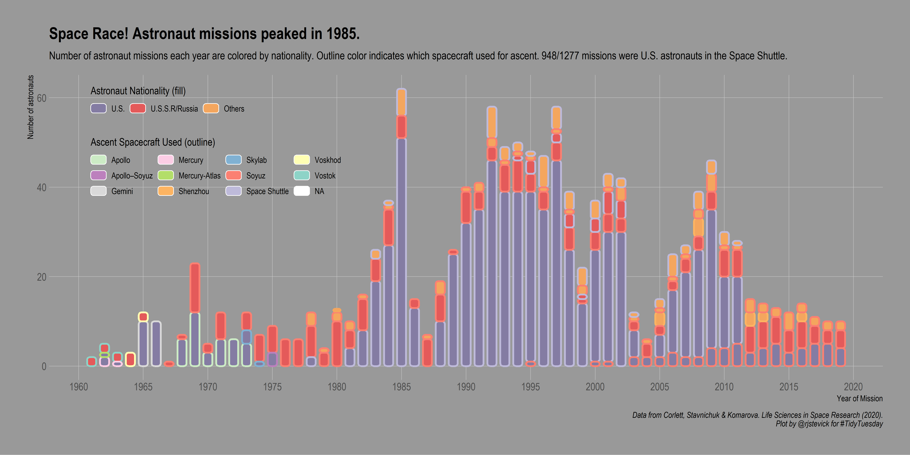</a>|
| 28 | `2020-07-07` | [Coffee Ratings](https://github.com/rfordatascience/tidytuesday/blob/master/data/2020/2020-07-07/readme.md) | [James LeDoux](https://github.com/jldbc/coffee-quality-database) & [Coffee Quality Db](https://github.com/jldbc/coffee-quality-database) | <a href="2020/20200707_CoffeeRatings/tidytuesday_20200707.R">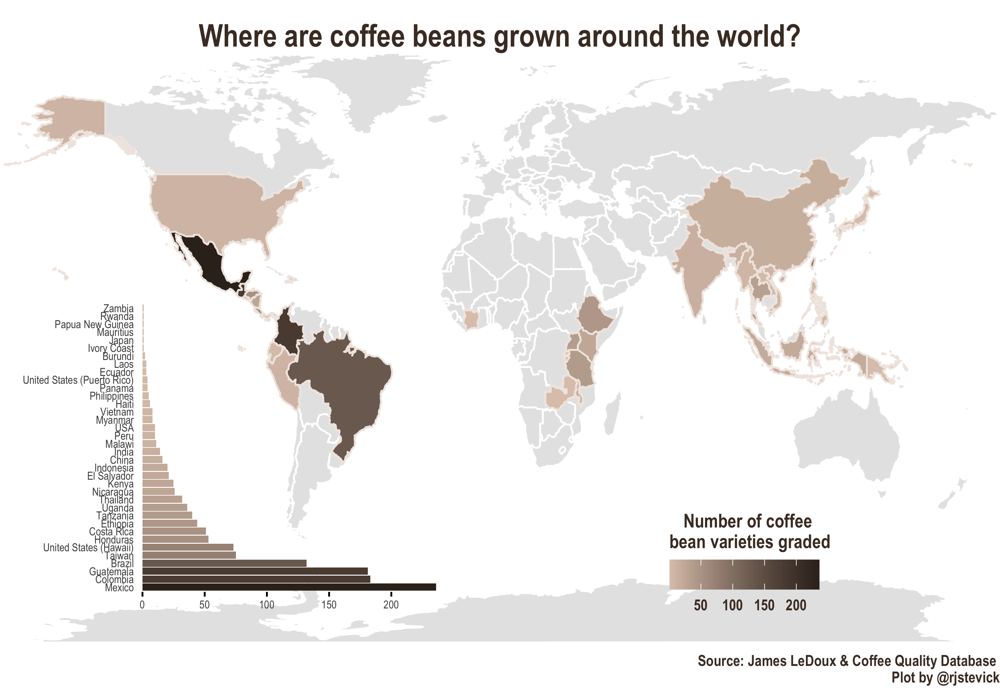</a>|
| 27 | `2020-06-30` | [Claremont Run of X-Men](https://github.com/rfordatascience/tidytuesday/blob/master/data/2020/2020-06-30/readme.md) | [Claremont Run](http://www.claremontrun.com/) | <a href="2020/20200630_ClaremontRun/tidytuesday_20200630.R">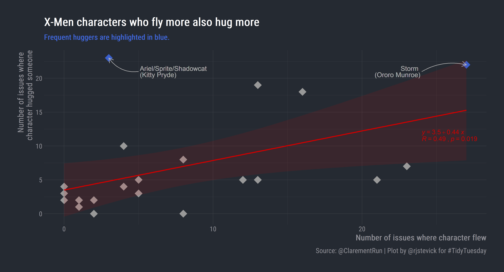</a>|
| 26 | `2020-06-23` | [Caribou Locations](https://github.com/rfordatascience/tidytuesday/blob/master/data/2020/2020-06-23/readme.md) | [Movebank](https://www.movebank.org/cms/movebank-content/about-movebank) | |
| 25 | `2020-06-16` | [African-American History](https://github.com/rfordatascience/tidytuesday/blob/master/data/2020/2020-06-16/readme.md) | [Black Past](https://www.blackpast.org/donate/) & [Census](https://www.census.gov/content/dam/Census/library/working-papers/2002/demo/POP-twps0056.pdf) & [Slave Voyages](https://slavevoyages.org/) | <a href="2020/20200616_AfricanAmericanHistory/tidytuesday_20200616.R">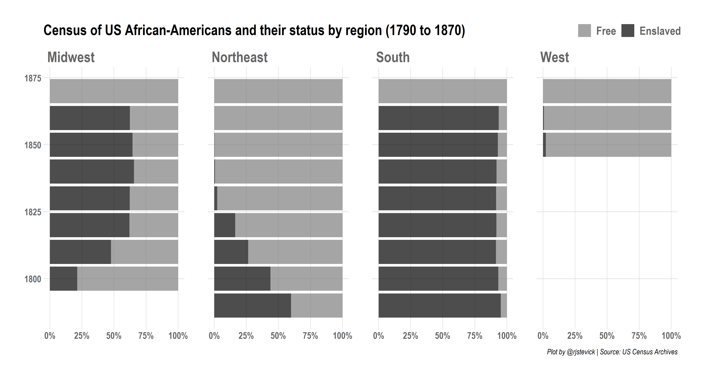</a>|
| 24 | `2020-06-09` | [African-American Achievements](https://github.com/rfordatascience/tidytuesday/blob/master/data/2020/2020-06-09/readme.md) | [Wikipedia](https://en.wikipedia.org/wiki/List_of_African-American_inventors_and_scientists) & [Wikipedia](https://en.wikipedia.org/wiki/List_of_African-American_firsts) | <a href="2020/20200609_AfricanAmericanAchievements/tidytuesday_20200609.R">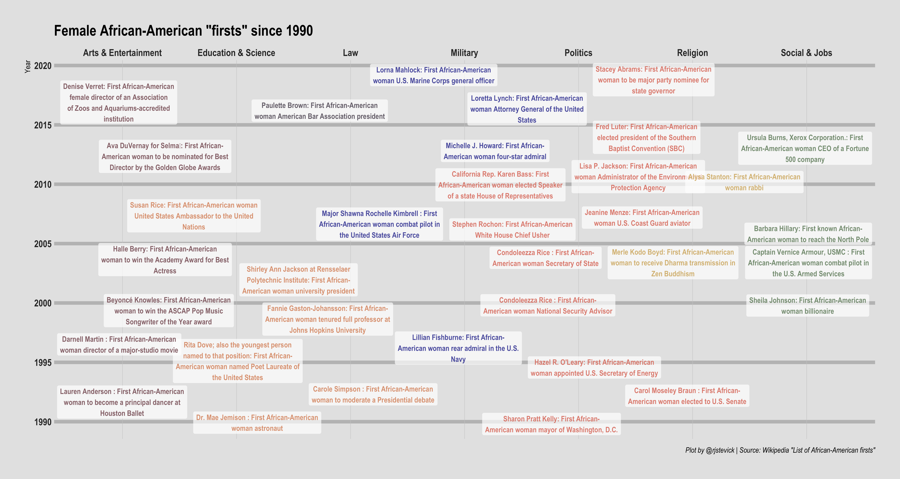</a>|
| 23 | `2020-06-02` | [Marble Races](https://github.com/rfordatascience/tidytuesday/blob/master/data/2020/2020-06-02/readme.md) | [Jelle's Marble Runs](https://www.youtube.com/channel/UCYJdpnjuSWVOLgGT9fIzL0g)| <a href="2020/20200602_MarbleRaces/tidytuesday_20200602.R"> 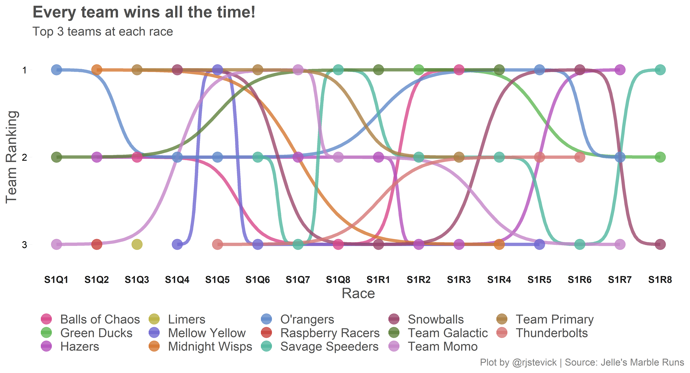</a> |
| 22 | `2020-05-26` | [Cocktails](https://github.com/rfordatascience/tidytuesday/blob/master/data/2020/2020-05-26/readme.md) | [Kaggle](https://www.kaggle.com/ai-first/cocktail-ingredients) & [Kaggle](https://www.kaggle.com/jenlooper/mr-boston-cocktail-dataset) | <a href="2020/20200526_Cocktails/tidytuesday_20200526.R"> 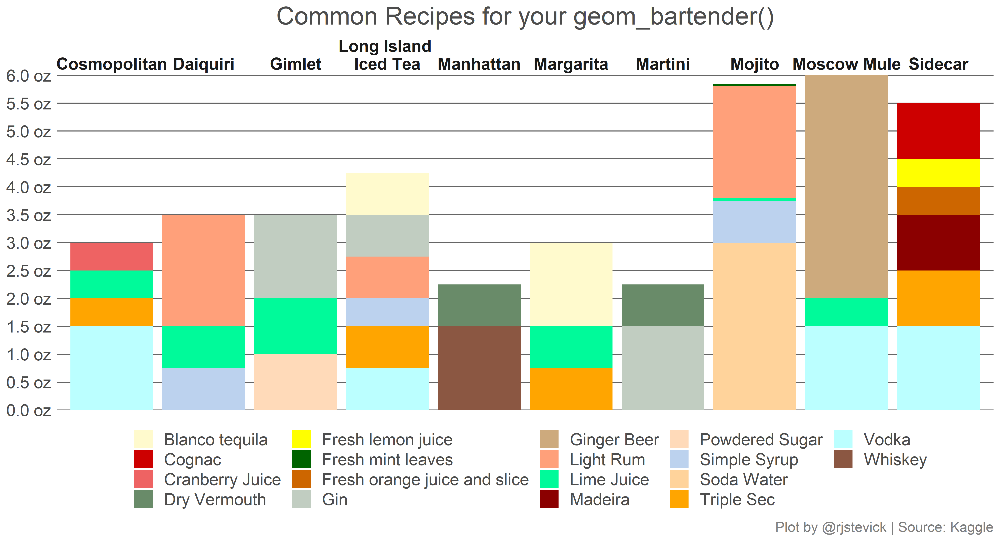</a>|
| 21 | `2020-05-19` | [Beach Volleyball](https://github.com/rfordatascience/tidytuesday/blob/master/data/2020/2020-05-19/readme.md) | [BigTimeStats](https://bigtimestats.blog/data/) |  |
| 20 | `2020-05-12` | [Volcano Eruptions](https://github.com/rfordatascience/tidytuesday/blob/master/data/2020/2020-05-12/readme.md) | [Smithsonian](https://www.himalayandatabase.com/) | <a href="2020/20200512_Volcanoes/tidytuesday_20200512.R"> 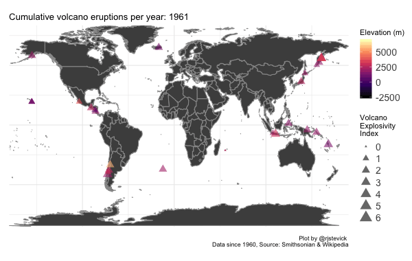</a> |
| 19 | `2020-05-05` | [Animal Crossing](https://github.com/rfordatascience/tidytuesday/blob/master/data/2020/2020-05-05/readme.md) | [Villager DB](https://github.com/jefflomacy/villagerdb) | <a href="2020/20200505_AnimalCrossing/tidytuesday_20200505.R"> 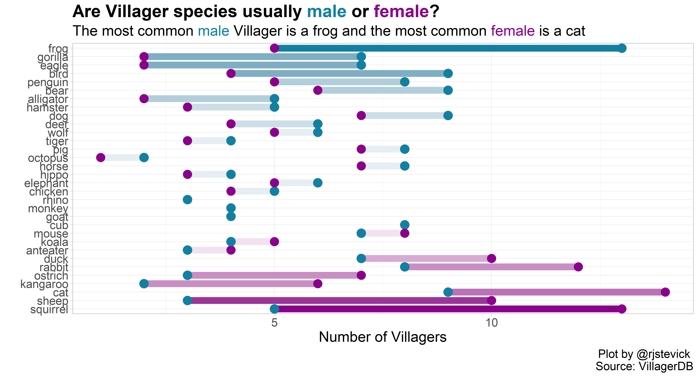</a> |
| 18 | `2020-04-28` | [Broadway Musicals](https://github.com/rfordatascience/tidytuesday/blob/master/data/2020/2020-04-28/readme.md) | [Playbill](https://www.playbill.com/grosses) | <a href="2020/20200428_BroadwayMusicals/tidytuesday_20200428.R"> 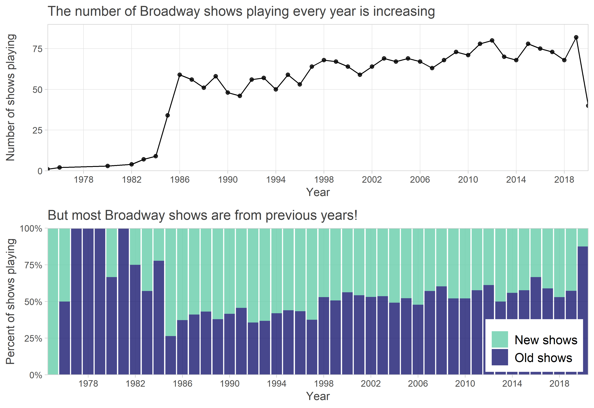</a>|
