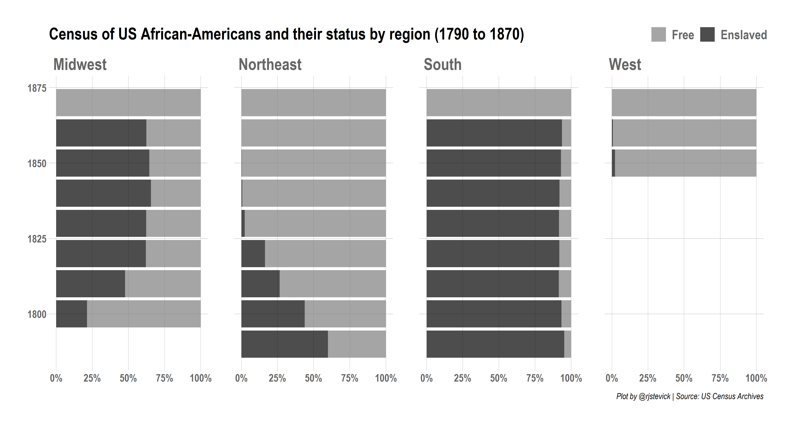
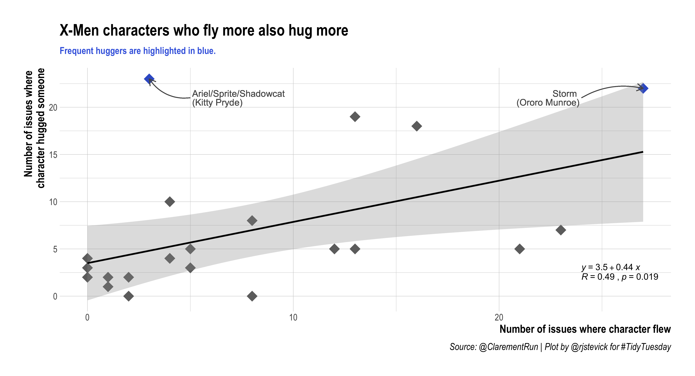
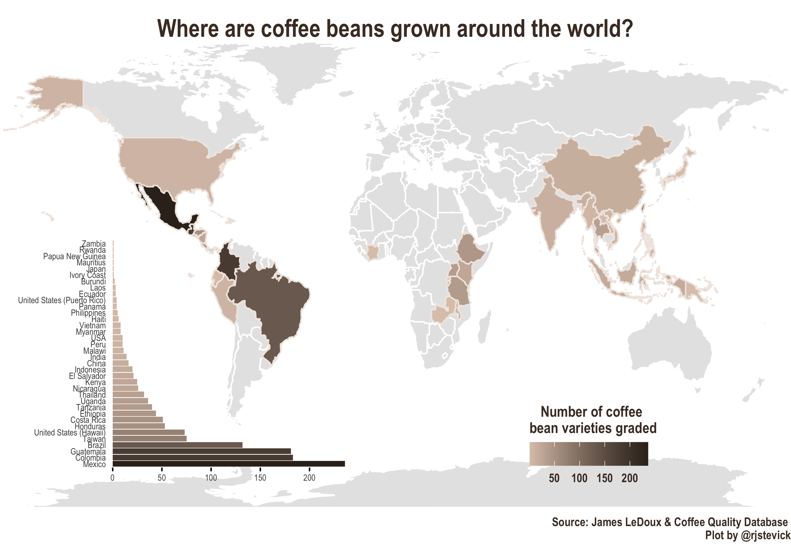
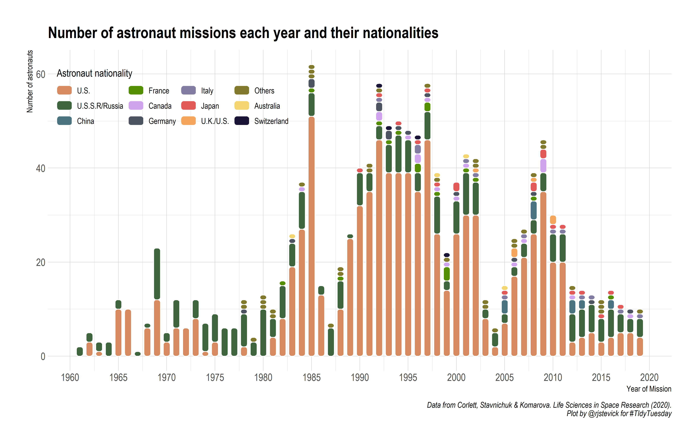
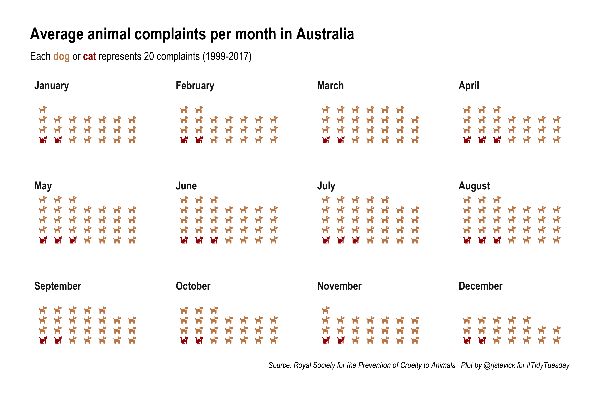
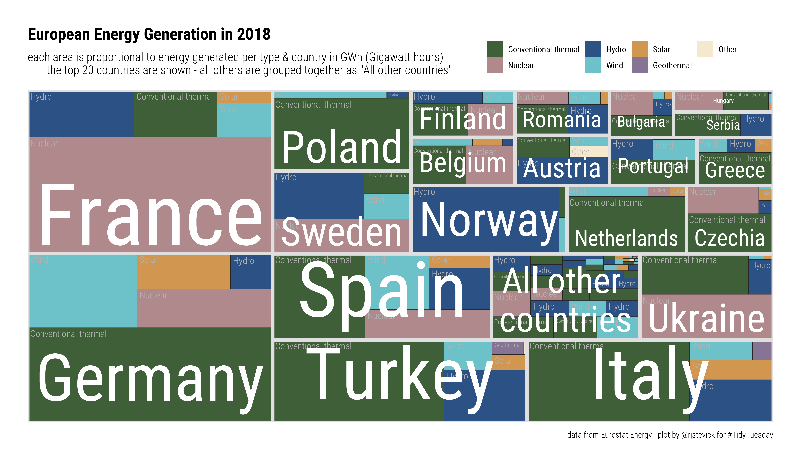
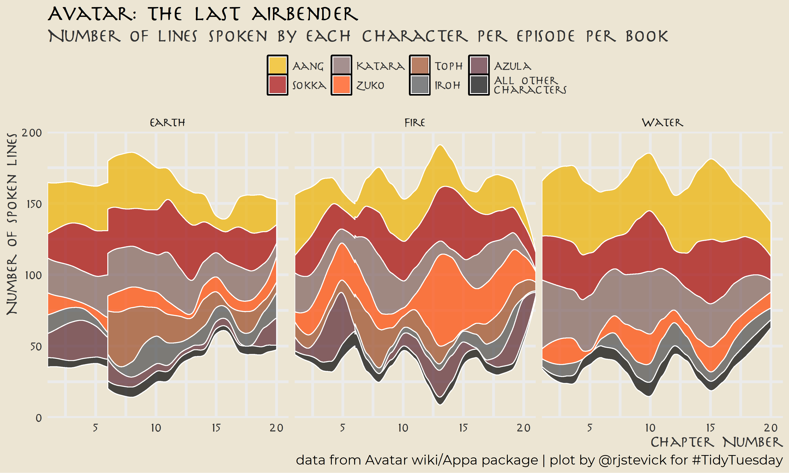

# TidyTuesday challenge code and plots

**A weekly data project in R from the R4DS online learning community**
https://github.com/rfordatascience/tidytuesday/

> The #tidytuesday project is a weekly data project aimed at the `R` ecosystem. An emphasis will be placed on understanding how to summarize and arrange data to make meaningful charts with `ggplot2`, `tidyr`, `dplyr`, and other tools in the `tidyverse` ecosystem.

## Contents
**My analyses and visualization of the datasets are organized by week. Each folder contains an Rscript and a png image.  
Click on the image to go to its code.**

### 2020

| Week | Date | Data | Source | Article | Link to code and plot |
| :---: | :----: | :--- | :--- | :--- | :--- |
| 18 | `2020-04-28` | [Broadway Musicals](https://github.com/rfordatascience/tidytuesday/blob/master/data/2020/2020-04-28/readme.md) | [Playbill](https://www.playbill.com/grosses) | [Alex Cookson](https://www.alexcookson.com/post/most-successful-broadway-show-of-all-time/) | |
| 19 | `2020-05-05` | [Animal Crossing](https://github.com/rfordatascience/tidytuesday/blob/master/data/2020/2020-05-05/readme.md) | [Villager DB](https://github.com/jefflomacy/villagerdb) | [Polygon](https://www.polygon.com/2020/4/2/21201065/animal-crossing-new-horizons-calm-mindfulness-coronavirus-quarantine) |  |
| 20 | `2020-05-12` | [Volcano Eruptions](https://github.com/rfordatascience/tidytuesday/blob/master/data/2020/2020-05-12/readme.md) | [Smithsonian](https://www.himalayandatabase.com/) | [Axios](https://www.axios.com/chart-every-volcano-that-erupted-since-krakatoa-467da621-41ba-4efc-99c6-34ff3cb27709.html) & [Wikipedia](https://en.wikipedia.org/wiki/Volcano) |  |
| 21 | `2020-05-19` | [Beach Volleyball](https://github.com/rfordatascience/tidytuesday/blob/master/data/2020/2020-05-19/readme.md) | [BigTimeStats](https://bigtimestats.blog/data/) | [FiveThirtyEight](https://fivethirtyeight.com/features/serving-is-a-disadvantage-in-some-olympic-sports/) & [Wikipedia](https://en.wikipedia.org/wiki/Beach_volleyball#Skills)|  |
| 22 | `2020-05-26` | [Cocktails](https://github.com/rfordatascience/tidytuesday/blob/master/data/2020/2020-05-26/readme.md) | [Kaggle](https://www.kaggle.com/ai-first/cocktail-ingredients) & [Kaggle](https://www.kaggle.com/jenlooper/mr-boston-cocktail-dataset) | [FiveThirtyEight](https://fivethirtyeight.com/videos/we-got-drunk-on-margaritas-for-science/) | |
| 23 | `2020-06-02` | [Marble Races](https://github.com/rfordatascience/tidytuesday/blob/master/data/2020/2020-06-02/readme.md) | [Jelle's Marble Runs](https://www.youtube.com/channel/UCYJdpnjuSWVOLgGT9fIzL0g)| [Randy Olson](http://www.randalolson.com/2020/05/24/a-data-driven-look-at-marble-racing/) |  |
| 24 | `2020-06-09` | [African-American Achievements](https://github.com/rfordatascience/tidytuesday/blob/master/data/2020/2020-06-09/readme.md) | [Wikipedia](https://en.wikipedia.org/wiki/List_of_African-American_inventors_and_scientists) & [Wikipedia](https://en.wikipedia.org/wiki/List_of_African-American_firsts) | [David Blackwell](https://www.stltoday.com/news/local/obituaries/david-blackwell-fought-racism-became-world-famous-statistician/article_8ea41058-5f35-5afa-9c3a-007200c5c179.html) & [Petition](https://www.change.org/p/american-statistical-association-rename-the-fisher-lecture-after-david-blackwell?recruiter=1107887809) | |
| 25 | `2020-06-16` | [African-American History](https://github.com/rfordatascience/tidytuesday/blob/master/data/2020/2020-06-16/readme.md) | [Black Past](https://www.blackpast.org/donate/) & [Census](https://www.census.gov/content/dam/Census/library/working-papers/2002/demo/POP-twps0056.pdf) & [Slave Voyages](https://slavevoyages.org/) | [The Guardian](https://www.theguardian.com/news/2019/aug/15/400-years-since-slavery-timeline) | |
| 26 | `2020-06-23` | [Caribou Locations](https://github.com/rfordatascience/tidytuesday/blob/master/data/2020/2020-06-23/readme.md) | [Movebank](https://www.movebank.org/cms/movebank-content/about-movebank) | [B.C. Ministry of Environment](https://www2.gov.bc.ca/assets/gov/environment/plants-animals-and-ecosystems/wildlife-wildlife-habitat/caribou/science_update_final_from_web_jan_2014.pdf) | |
| 27 | `2020-06-30` | [Claremont Run of X-Men](https://github.com/rfordatascience/tidytuesday/blob/master/data/2020/2020-06-30/readme.md) | [Claremont Run](http://www.claremontrun.com/) | [Wikipedia - Uncanny X-Men](https://en.wikipedia.org/wiki/Uncanny_X-Men) | |
| 28 | `2020-07-07` | [Coffee Ratings](https://github.com/rfordatascience/tidytuesday/blob/master/data/2020/2020-07-07/readme.md) | [James LeDoux](https://github.com/jldbc/coffee-quality-database) & [Coffee Quality Db](https://github.com/jldbc/coffee-quality-database)  | [Yorgos Askalidis - TWD](https://towardsdatascience.com/the-data-speak-ethiopia-has-the-best-coffee-91f88ed37e84)| |
| 29 | `2020-07-14` | [Astronaut Database](https://github.com/rfordatascience/tidytuesday/blob/master/data/2020/2020-07-14/readme.md) | [Corlett, Stavnichuk & Komarova](https://www.sciencedirect.com/science/article/abs/pii/S2214552420300444) | [Corlett, Stavnichuk & Komarova](https://www.sciencedirect.com/science/article/abs/pii/S2214552420300444) | |
| 30 | `2020-07-21` | [Australian Animal Outcomes](https://github.com/rfordatascience/tidytuesday/blob/master/data/2020/2020-07-21/readme.md) | [RSPCA](https://www.rspca.org.au/what-we-do/our-role-caring-animals/annual-statistics) | [RSPCA Report](https://www.rspca.org.au/sites/default/files/RSPCA%20Report%20on%20animal%20outcomes%202018-2019.pdf) | |
| 31 | `2020-07-28` | [Palmer Penguins](https://github.com/rfordatascience/tidytuesday/blob/master/data/2020/2020-07-28/readme.md) | [Gorman, Williams & Fraser, 2014](https://doi.org/10.1371/journal.pone.0090081) | [Palmer Penguins](https://allisonhorst.github.io/palmerpenguins/) | |
| 32 | `2020-08-04` | [European Energy](https://github.com/rfordatascience/tidytuesday/blob/master/data/2020/2020-08-04/readme.md) | [Eurostat Energy](https://ec.europa.eu/eurostat/statistics-explained/index.php/Electricity_generation_statistics_%E2%80%93_first_results) | [Washington Post Energy](https://www.washingtonpost.com/climate-environment/2020/07/30/biden-calls-100-percent-clean-electricity-by-2035-heres-how-far-we-have-go/) | |
| 33 | `2020-08-11` | [Avatar: The Last Airbender](https://github.com/rfordatascience/tidytuesday/blob/master/data/2020/2020-08-11/readme.md) | [`appa`](https://github.com/averyrobbins1/appa) | [Exploring Avatar: The Last Airbender transcript data](https://www.avery-robbins.com/2020/07/11/avatar-eda/) | |
