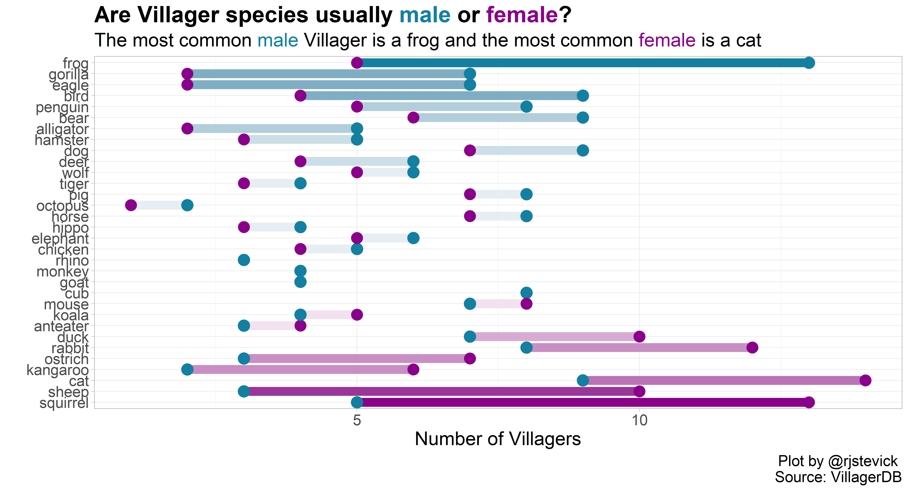
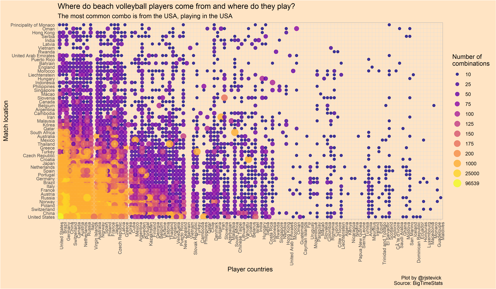
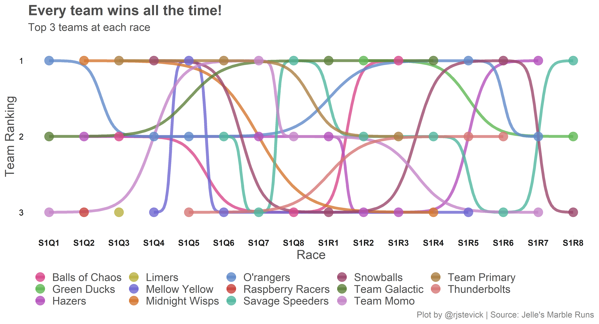
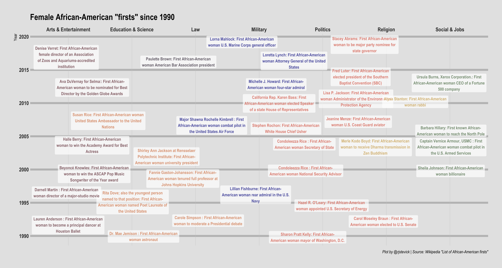

# TidyTuesday challenge code and plots

**A weekly data project in R from the R4DS online learning community**
https://github.com/rfordatascience/tidytuesday/

> The #tidytuesday project is a weekly data project aimed at the `R` ecosystem. An emphasis will be placed on understanding how to summarize and arrange data to make meaningful charts with `ggplot2`, `tidyr`, `dplyr`, and other tools in the `tidyverse` ecosystem.

## Contents
**My analyses and visualization of the datasets are organized by week. Each folder contains an Rscript and a png image.**

### 2020

| Week | Date | Data | Source | Article | My code and plot |
| :---: | :----: | :--- | :--- | :--- | :--- |
| 18 | `2020-04-28` | [Broadway Musicals](https://github.com/rfordatascience/tidytuesday/blob/master/data/2020/2020-04-28/readme.md) | [Playbill](https://www.playbill.com/grosses) | [Alex Cookson](https://www.alexcookson.com/post/most-successful-broadway-show-of-all-time/) | |
| 19 | `2020-05-05` | [Animal Crossing](https://github.com/rfordatascience/tidytuesday/blob/master/data/2020/2020-05-05/readme.md) | [Villager DB](https://github.com/jefflomacy/villagerdb) | [Polygon](https://www.polygon.com/2020/4/2/21201065/animal-crossing-new-horizons-calm-mindfulness-coronavirus-quarantine) |  [20200505_AnimalCrossing/](20200505_AnimalCrossing/)  |
| 20 | `2020-05-12` | [Volcano Eruptions](https://github.com/rfordatascience/tidytuesday/blob/master/data/2020/2020-05-12/readme.md) | [Smithsonian](https://www.himalayandatabase.com/) | [Axios](https://www.axios.com/chart-every-volcano-that-erupted-since-krakatoa-467da621-41ba-4efc-99c6-34ff3cb27709.html) & [Wikipedia](https://en.wikipedia.org/wiki/Volcano) |  [20200512_Volcanoes/](20200512_Volcanoes/)  |
| 21 | `2020-05-19` | [Beach Volleyball](https://github.com/rfordatascience/tidytuesday/blob/master/data/2020/2020-05-19/readme.md) | [BigTimeStats](https://bigtimestats.blog/data/) | [FiveThirtyEight](https://fivethirtyeight.com/features/serving-is-a-disadvantage-in-some-olympic-sports/) & [Wikipedia](https://en.wikipedia.org/wiki/Beach_volleyball#Skills)| [20200519_BeachVolleyball/](20200519_BeachVolleyball/)  |
| 22 | `2020-05-26` | [Cocktails](https://github.com/rfordatascience/tidytuesday/blob/master/data/2020/2020-05-26/readme.md) | [Kaggle](https://www.kaggle.com/ai-first/cocktail-ingredients) & [Kaggle](https://www.kaggle.com/jenlooper/mr-boston-cocktail-dataset) | [FiveThirtyEight](https://fivethirtyeight.com/videos/we-got-drunk-on-margaritas-for-science/) | [20200526_Cocktails/](20200526_Cocktails/) |
| 23 | `2020-06-02` | [Marble Races](https://github.com/rfordatascience/tidytuesday/blob/master/data/2020/2020-06-02/readme.md) | [Jelle's Marble Runs](https://www.youtube.com/channel/UCYJdpnjuSWVOLgGT9fIzL0g)| [Randy Olson](http://www.randalolson.com/2020/05/24/a-data-driven-look-at-marble-racing/) | [20200602_MarbleRaces/](20200602_MarbleRaces/)  |
| 24 | `2020-06-09` | [African-American Achievements](https://github.com/rfordatascience/tidytuesday/blob/master/data/2020/2020-06-09/readme.md) | [Wikipedia](https://en.wikipedia.org/wiki/List_of_African-American_inventors_and_scientists) & [Wikipedia](https://en.wikipedia.org/wiki/List_of_African-American_firsts) | [David Blackwell](https://www.stltoday.com/news/local/obituaries/david-blackwell-fought-racism-became-world-famous-statistician/article_8ea41058-5f35-5afa-9c3a-007200c5c179.html) & [Petition for David Blackwell](https://www.change.org/p/american-statistical-association-rename-the-fisher-lecture-after-david-blackwell?recruiter=1107887809) | [20200609_African AmericanAchievements/](20200609_AfricanAmericanAchievements/)  |
